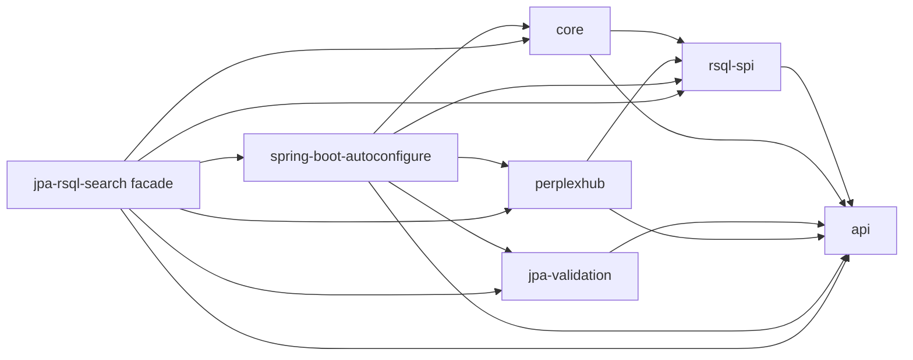
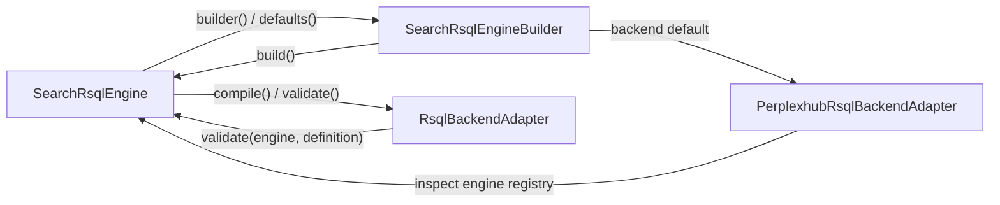
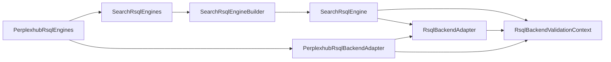
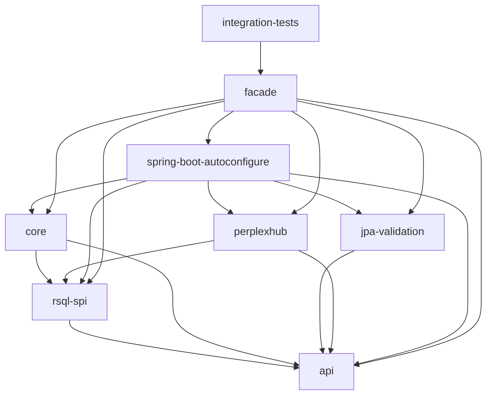
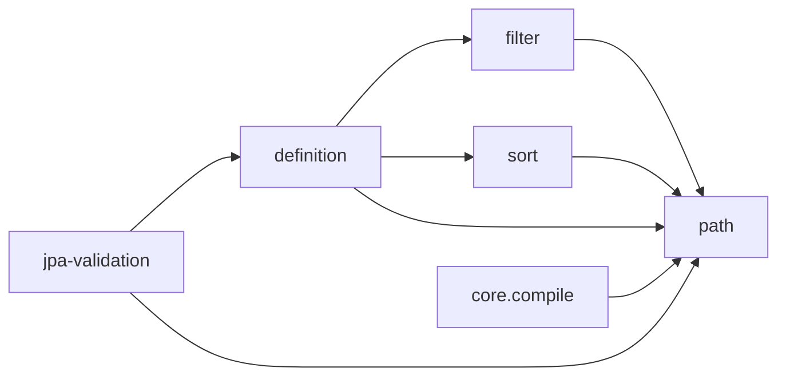
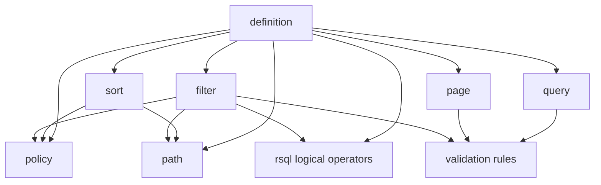
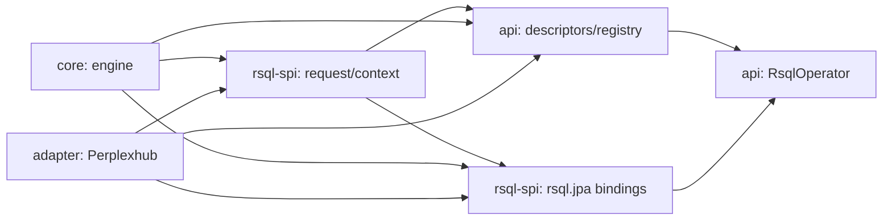
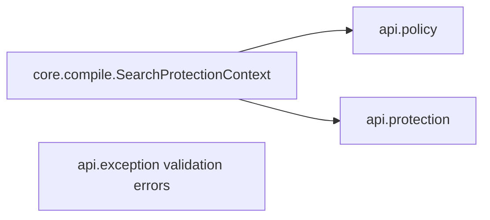
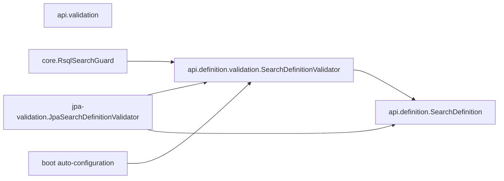
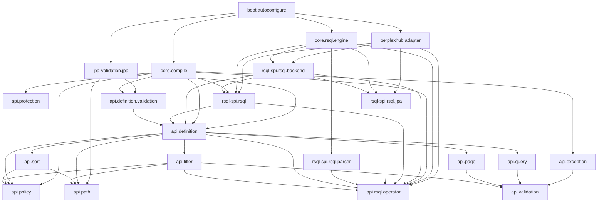

# Plan De Reestructuracion Para Los Findings De SonarCloud

## Directiva De Ejecucion V2

Este documento se ejecuta directamente como arquitectura 2.0. Las secciones
que describen transiciones 1.x, bridges deprecated, compatibilidad binaria,
`japicmp` o un artefacto facade quedan reemplazadas por estas decisiones:

- no se conserva ninguna API ni FQCN legacy;
- no se crea un modulo facade ni un relocation POM;
- `io.github.ggomarighetti:jpa-rsql-search` queda congelado en la linea 1.x;
- el punto de entrada 2.x es
  `io.github.ggomarighetti:jpa-rsql-search-spring-boot-starter`;
- el starter combinado contiene la auto-configuracion y depende de los
  modulos funcionales;
- todos los modulos publicables comparten la version `2.0.0-SNAPSHOT` durante
  el desarrollo y se publican atomicamente;
- las rupturas se documentan en una guia de migracion, pero no se adaptan.

La arquitectura ejecutable queda formada por:

```text
jpa-rsql-search-parent
|
+-- jpa-rsql-search-api
+-- jpa-rsql-search-rsql-spi
+-- jpa-rsql-search-core
+-- jpa-rsql-search-jpa-validation
+-- jpa-rsql-search-perplexhub
+-- jpa-rsql-search-spring-boot-starter
`-- integration-tests
```

Baseline reproducible del 19 de junio de 2026 sobre `e7c236a`:

- `mvn verify`: verde;
- `mvn -Pcoverage,release verify`: verde;
- 245 tests unitarios y 32 tests de integracion;
- Quality Gate SonarCloud: verde;
- coverage reportada por SonarCloud: 100%;
- cero bugs, vulnerabilidades, code smells y hotspots.

Documento de arquitectura y ejecucion para eliminar los seis hallazgos
identificados en `SONARCLOUD_ARCHITECTURE_FINDINGS.md`, usando como fuentes:

- el inventario completo de `SRC_HELP_MEMORY.md`;
- el contrato funcional y publico descrito en `README.md`;
- el codigo actual de `src/main/java` y sus tests;
- el analisis SonarCloud de `master` para el commit
  `e7c236ac22592e7cce145fae6b8e7fb8c9829b22`.

Este archivo es deliberadamente unico y evolutivo. Cada finding se procesa en
orden, se incorpora a la solucion acumulada y deja un checkpoint explicito.
No reemplaza `SRC_HELP_MEMORY.md` ni modifica el diagnostico original.

## 1. Objetivo

La reestructuracion debe terminar con:

1. cero `tangles`;
2. cero componentes `oversized`;
3. cero `weak tangles`;
4. cero `split responsibilities`;
5. una direccion de dependencias verificable y protegida por tests;
6. el comportamiento publico documentado en `README.md` preservado, salvo
   cambios de API que se publiquen expresamente como una version mayor;
7. auto-configuracion Spring Boot, compilacion RSQL, protecciones, conversion,
   validacion, operadores custom y backend Perplexhub funcionalmente
   equivalentes.

El cierre real no se declara solo porque el codigo compile. El ultimo gate es
un nuevo analisis de SonarCloud sobre el commit reestructurado.

## 2. Restricciones Que Gobiernan El Diseno

### 2.1 Es una libreria publica estable

El proyecto publica `io.github.ggomarighetti:jpa-rsql-search:1.0.1` en Maven
Central y declara SemVer. Cambiar package, borrar tipos publicos o cambiar
firmas publicas es una ruptura binaria y de codigo fuente.

Por eso se distinguen dos estados:

- `transicion 1.x`: introducir contratos nuevos, deprecar los anteriores y
  mantener adaptadores cuando no reproduzcan el problema estructural;
- `arquitectura final 2.0`: retirar los tipos legacy que por su mera presencia
  mantienen un finding o una dependencia incorrecta.

No se debe prometer que todos los findings desaparecen durante la fase de
compatibilidad. El estado que cumple el objetivo completo es el de 2.0.

### 2.2 El producto sigue siendo JPA

La libreria no intenta transformarse en un compilador agnostico de persistencia.
Su resultado publico continua siendo `Specification<T>` y `Pageable`. La
separacion requerida es entre:

- contrato de busqueda de la aplicacion;
- protocolo RSQL y sus SPI;
- orquestacion runtime;
- adaptadores concretos, especialmente Perplexhub;
- ensamblado Spring Boot.

### 2.3 Las protecciones son invariantes

La reestructuracion no puede cambiar el orden defensivo actual:

1. preflight sintactico;
2. presupuesto de AST y comparaciones;
3. declaracion de selector y operador;
4. conversion y reglas de argumento;
5. compilacion backend;
6. validaciones cruzadas de filtro, query, paging y sorting.

Los tests de `SearchProtectionContext`, `RsqlSearchGuard`,
`SearchPageableGuard`, `SearchQueryGuard`, property tests e integraciones
PostgreSQL son evidencia obligatoria.

## 3. Formato Usado Para Cada Finding

Cada seccion sigue esta ficha:

| Campo | Contenido |
|---|---|
| Senal Sonar | Categoria, clases y packages detectados |
| Problema real | Causa arquitectonica, no solo el sintoma |
| Invariantes | Comportamiento que no se puede perder |
| Decision | Frontera y direccion de dependencias elegida |
| Cambios | Tipos, firmas, packages, modulos y wiring afectados |
| Compatibilidad | Estrategia 1.x y estado final 2.0 |
| Tests | Pruebas a mover, adaptar o agregar |
| Criterio de cierre | Evidencia local y evidencia Sonar |
| Efecto acumulado | Como altera el plan construido hasta ese punto |

Cada finding termina con un bloque `Checkpoint` para dejar asentado que el
documento fue guardado antes de pasar al siguiente.

## 4. Principios De La Arquitectura Objetivo

1. Las dependencias forman un DAG; ningun package o modulo puede depender de
   otro que ya dependa de el.
2. Los orquestadores dependen de contratos pequenos; ningun SPI recibe un
   orquestador completo para consultar su estado.
3. El modelo de definicion compone capacidades, pero esas capacidades no
   vuelven a depender del package `definition`.
4. La metadata neutral de RSQL no conoce adaptadores concretos.
5. La ejecucion JPA custom es un contrato explicito, no una dependencia
   accidental entre `operator` y `backend`.
6. Los packages se nombran por responsabilidad de dominio o capa, no por
   mecanismo generico cuando ese mecanismo mezcla dominios distintos.
7. La auto-configuracion solo ensambla; no contiene reglas de dominio.
8. Los modulos publican fronteras tecnicas que Sonar, Maven y los tests puedan
   observar.

## 5. Arquitectura Final Propuesta

La forma final es un proyecto Maven multi-modulo con un artefacto facade que
conserva la coordenada historica.

```text
jpa-rsql-search-parent
|
+-- jpa-rsql-search-api
+-- jpa-rsql-search-rsql-spi
+-- jpa-rsql-search-core
+-- jpa-rsql-search-jpa-validation
+-- jpa-rsql-search-perplexhub
+-- jpa-rsql-search-spring-boot-autoconfigure
`-- jpa-rsql-search
```

Responsabilidad preliminar:

| Modulo | Responsabilidad | Puede depender de |
|---|---|---|
| `api` | Definiciones, capabilities, policy, errores, DTOs y metadata publica de operadores | dependencias externas de API |
| `rsql-spi` | AST, parser SPI, request de compilacion, backend SPI y bindings JPA custom | `api` |
| `core` | `SearchCompiler`, guards, protecciones runtime y motor RSQL | `api`, `rsql-spi` |
| `jpa-validation` | Validacion de definiciones contra metamodelo JPA | `api` |
| `perplexhub` | Implementacion del backend RSQL con Perplexhub | `api`, `rsql-spi` |
| `spring-boot-autoconfigure` | Beans, properties y ensamblado condicional | todos los modulos anteriores |
| facade `jpa-rsql-search` | Compatibilidad de coordenada y dependencias transitivas | modulos publicables |

Direccion objetivo:



Regla central: no existe una flecha desde `api` hacia otro modulo del proyecto,
ni desde `rsql-spi` hacia `core` o `perplexhub`.

## 6. Estrategia De Verificacion Arquitectonica

Se agregaran tests ArchUnit y controles Maven:

- ningun ciclo entre packages;
- `api` no depende de packages de runtime, adapters o boot;
- `rsql-spi` no depende de `core`, `perplexhub` ni autoconfiguracion;
- `core` no importa clases Perplexhub;
- `perplexhub` no importa `SearchRsqlEngine`;
- `validation` generico no importa `SearchDefinition`;
- `filter` y `sort` no importan desde `definition`;
- `exception` no contiene protecciones de recursos;
- cada modulo respeta sus dependencias Maven declaradas;
- `mvn verify`, `mvn -Pcoverage verify` y `mvn -Prelease verify`;
- analisis SonarCloud con los seis contadores en cero.

Durante la implementacion se incorporara `japicmp` o una herramienta
equivalente contra la ultima version 1.x para clasificar cada ruptura publica y
evitar cambios accidentales fuera del plan.

## 7. Registro Secuencial

| Checkpoint | Estado | Resultado acumulado |
|---|---|---|
| Base | Guardado | Formato, restricciones, DAG preliminar y gates definidos |
| Finding 1 | Guardado | Tangle resuelto mediante factory externo y contexto backend estrecho |
| Finding 2 | Guardado | Oversized resuelto mediante componentes Maven observables |
| Finding 3 | Guardado | Weak tangle principal resuelto con path compartido y SPI bien ubicado |
| Finding 4 | Guardado | Metadata RSQL y ejecucion JPA separadas en registries |
| Finding 5 | Guardado | Excepcion de proteccion movida a su dominio |
| Finding 6 | Guardado | SPI de definiciones separado de Bean Validation |
| Consolidacion | Guardado | Migracion, mapa de 56 archivos y arquitectura final completos |

## 8. Finding 1 - Flaw: Tangle RSQL

### 8.1 Senal Sonar

Clases involucradas:

- `rsql.SearchRsqlEngine`;
- `rsql.SearchRsqlEngineBuilder`;
- `rsql.backend.RsqlBackendAdapter`;
- `rsql.backend.perplexhub.PerplexhubRsqlBackendAdapter`.

Los ciclos reales son:



### 8.2 Problema Real

Hay tres responsabilidades mezcladas:

1. `SearchRsqlEngine` ejecuta parsing, validacion y compilacion.
2. El mismo tipo conoce su mecanismo concreto de construccion.
3. El backend recibe el orquestador completo para recuperar solo el registry.

Esto impide invertir correctamente las dependencias. Tambien obliga al core a
conocer Perplexhub porque el builder lo instancia como default.

### 8.3 Invariantes

- El mismo `ConversionService` debe usarse en validacion y ejecucion.
- El backend debe validar todos los operadores usados por una definicion.
- `RsqlBackendAdapter` sigue siendo reemplazable por aplicaciones.
- Los customizers Spring deben ejecutarse en orden.
- `SearchRsqlEngine` debe seguir siendo inmutable despues de construirse.
- El backend default continua siendo Perplexhub cuando se usa la
  auto-configuracion o el factory de conveniencia correspondiente.

### 8.4 Decision

Se aplican tres cambios coordinados.

#### A. Contexto estrecho de validacion

Se crea en `rsql-spi`:

```java
public record RsqlBackendValidationContext(
        SearchDefinition<?> definition,
        RsqlOperatorRegistry operators,
        ConversionService conversionService) {
}
```

La firma final del SPI sera:

```java
public interface RsqlBackendAdapter {
    <T> Specification<T> compile(RsqlCompilationRequest<T> request);

    default void validate(RsqlBackendValidationContext context) {
    }
}
```

El backend ya no puede consultar parsing, builder, backend activo u otro estado
interno del engine. Recibe exactamente la definicion, el registry y el servicio
de conversion.

#### B. Factory externo para construir engines

`SearchRsqlEngine` deja de exponer `builder()` y `defaults()`. La construccion
se inicia desde un factory que depende del engine, nunca al reves:

```java
SearchRsqlEngine engine = SearchRsqlEngines.builder(customBackend)
        .conversionService(conversionService)
        .operator(descriptor)
        .build();
```

Para el caso Perplexhub sin Spring:

```java
SearchRsqlEngine engine = PerplexhubRsqlEngines.defaults();
```

Direccion resultante:



No hay camino de regreso desde `Engine` hacia `Builder`, ni desde `Backend`
hacia `Engine`.

#### C. El core no elige un adapter concreto

`SearchRsqlEngineBuilder` deja de tener:

```java
private RsqlBackendAdapter backend = new PerplexhubRsqlBackendAdapter();
```

El backend pasa a ser obligatorio en el punto de entrada del builder. La
auto-configuracion y `PerplexhubRsqlEngines` son los composition roots que
seleccionan `PerplexhubRsqlBackendAdapter`.

### 8.5 Cambios Por Archivo

| Archivo actual | Accion final |
|---|---|
| `rsql/SearchRsqlEngine.java` | Quitar `builder()` y `defaults()`; construir y enviar `RsqlBackendValidationContext`; conservar parsing, validacion neutral y delegacion de compile |
| `rsql/SearchRsqlEngineBuilder.java` | Eliminar import e instancia de Perplexhub; exigir backend; construir engine sin dependencia inversa |
| nuevo `rsql/SearchRsqlEngines.java` | Ser el punto de entrada neutral para builders con backend explicito |
| `rsql/SearchRsqlEngineCustomizer.java` | Continuar customizando el builder; actualizar package/module si corresponde |
| `rsql/backend/RsqlBackendAdapter.java` | Reemplazar `validate(SearchRsqlEngine, SearchDefinition<?>)` por `validate(RsqlBackendValidationContext)` |
| nuevo `rsql/backend/RsqlBackendValidationContext.java` | Exponer solo definicion, operators y conversion service |
| `rsql/backend/perplexhub/PerplexhubRsqlBackendAdapter.java` | Leer registry y definicion desde el contexto; eliminar import de `SearchRsqlEngine` |
| nuevo `rsql/backend/perplexhub/PerplexhubRsqlEngines.java` | Ofrecer conveniencia standalone con el adapter default |
| `autoconfigure/JpaRsqlSearchRsqlAutoConfiguration.java` | Crear builder mediante factory neutral, inyectar backend y aplicar customizers |
| `README.md` | Sustituir ejemplos directos de `SearchRsqlEngine.builder/defaults` y explicar factory neutral vs factory Perplexhub |

### 8.6 Compatibilidad

#### Transicion 1.x

Se pueden introducir el contexto y los factories nuevos, marcar como
`@Deprecated(forRemoval = true)` los metodos y firmas antiguas, y adaptar el
backend Perplexhub a ambos contratos.

Sin embargo, mientras existan:

```java
SearchRsqlEngine.builder()
RsqlBackendAdapter.validate(SearchRsqlEngine, SearchDefinition<?>)
```

Sonar puede seguir observando el tangle. Esa fase reduce el costo de migracion,
pero no es el estado de cierre.

#### Arquitectura final 2.0

Se eliminan las dos APIs deprecated:

- `SearchRsqlEngine.builder()` y `SearchRsqlEngine.defaults()`;
- `RsqlBackendAdapter.validate(SearchRsqlEngine, SearchDefinition<?>)`.

Los consumidores migran a `SearchRsqlEngines`,
`PerplexhubRsqlEngines` y `RsqlBackendValidationContext`.

### 8.7 Tests

Actualizar:

- `RsqlEngineCoverageTest`;
- `PerplexhubRsqlBackendAdapterTest`;
- `RsqlSearchGuardTest`;
- `RsqlPropertyTest`;
- `SearchCompilerTest`;
- `JpaRsqlSearchRsqlAutoConfigurationTest`;
- `PublicApiSurfaceTest`;
- integraciones que registran `SearchRsqlEngineCustomizer`.

Agregar:

1. un test que pruebe que un backend custom recibe el mismo registry y
   `ConversionService` usados por el engine;
2. un test que pruebe que Perplexhub valida operadores custom sin acceder al
   engine;
3. una regla ArchUnit que prohiba imports de `SearchRsqlEngine` desde
   `rsql.backend..`;
4. una regla ArchUnit que prohiba imports `perplexhub..` desde `core`;
5. un test de API que confirme que el engine no expone factories estaticos en
   2.0.

### 8.8 Criterio De Cierre

- no existe dependencia `SearchRsqlEngine -> SearchRsqlEngineBuilder`;
- no existe dependencia `RsqlBackendAdapter -> SearchRsqlEngine`;
- no existe dependencia del builder core hacia Perplexhub;
- todos los tests de engine, backend, compiler y auto-configuracion pasan;
- SonarCloud deja de mostrar el tangle de cuatro clases.

### 8.9 Efecto Acumulado

Este finding fija una regla para los siguientes: `core` conoce el SPI, pero los
adaptadores no conocen `core`. Tambien obliga a ubicar el contexto de backend
en `rsql-spi`, no en el modulo del engine.

### Checkpoint Finding 1

Estado guardado: causa, API objetivo, compatibilidad, archivos, tests y criterio
de cierre del tangle definidos antes de procesar `Oversized`.

## 9. Finding 2 - Flaw: Oversized

### 9.1 Senal Sonar

SonarCloud marca el componente:

```text
io.github.ggomarighetti.jparsqlsearch
```

con `56 children`. Esas 56 hojas coinciden con todos los tipos productivos
actuales de `src/main/java`.

Distribucion actual:

| Package | Hojas |
|---|---:|
| `autoconfigure` | 3 |
| `compile` | 9 |
| `definition` | 4 |
| `exception` | 7 |
| `filter` | 5 |
| `jpa` | 1 |
| `page` | 1 |
| `policy` | 1 |
| `query` | 2 |
| `rsql` | 6 |
| `rsql.backend` | 3 |
| `rsql.backend.perplexhub` | 2 |
| `rsql.operator` | 6 |
| `rsql.parser` | 2 |
| `sort` | 1 |
| `validation` | 3 |

### 9.2 Problema Real

El unico source set productivo funciona simultaneamente como:

- API publica;
- runtime de compilacion;
- SPI RSQL;
- adapter Perplexhub;
- validacion JPA;
- auto-configuracion Spring Boot.

Los packages existentes expresan temas, pero Maven, Sonar y los consumidores
siguen viendo un solo componente desplegable. Mover clases entre subpackages
dentro del mismo modulo no crea una frontera tecnica y no garantiza que el
contenedor raiz deje de acumular todas las hojas.

No hay evidencia de que una clase concreta sea la causa del finding.
`SearchPolicy`, aunque grande, no es el componente marcado. Dividirla solo para
reducir lineas agregaria hojas y desviaria el objetivo.

### 9.3 Invariantes

- La dependencia historica `io.github.ggomarighetti:jpa-rsql-search` queda
  congelada en 1.x.
- Spring Boot debe descubrir la auto-configuracion desde el classpath final.
- No se deben duplicar clases con el mismo FQCN en dos jars.
- Cada clase tiene un unico modulo owner.
- Los modulos no pueden formar ciclos Maven.
- Los sources y Javadocs de cada artefacto publicable deben generarse.

### 9.4 Decision

Convertir el repositorio a multi-modulo sin facade ni capa de compatibilidad.
Cada modulo se expone como directorio de primer nivel para que el ownership sea
visible sin una carpeta contenedora artificial.

Estructura final:

```text
pom.xml                                  parent/aggregator
jpa-rsql-search-api/
jpa-rsql-search-rsql-spi/
jpa-rsql-search-core/
jpa-rsql-search-jpa-validation/
jpa-rsql-search-perplexhub/
jpa-rsql-search-spring-boot-starter/
integration-tests/                       no publicable
```

El parent usa un artifact distinto, por ejemplo:

```text
io.github.ggomarighetti:jpa-rsql-search-parent
```

El starter publica el punto de entrada combinado:

```text
io.github.ggomarighetti:jpa-rsql-search-spring-boot-starter
```

y declara dependencias transitivas sobre los modulos funcionales.

### 9.5 Presupuesto De Hojas Por Modulo

El reparto incluye los tipos nuevos introducidos por este plan; por eso el
total final puede superar 56 sin que ningun componente vuelva a ser oversized.

| Modulo | Contenido aproximado | Hojas esperadas |
|---|---|---:|
| `api` | definition, path, capabilities, policy, validacion, errores y package completo `rsql.operator` | 30 |
| `rsql-spi` | AST/request, parser SPI, backend SPI y contratos/bindings JPA | 11 |
| `core` | compiler, guards, engine, builder y factories neutrales | 13 |
| `jpa-validation` | validator de metamodelo JPA | 1 |
| `perplexhub` | adapter, options y factory de conveniencia | 3 |
| `spring-boot-autoconfigure` | auto-configurations y properties | 3 |
| `facade` | idealmente sin clases; solo dependencias y metadata de publicacion | 0 |

Estos valores son presupuesto, no una invitacion a agregar clases hasta el
limite. Cada nuevo tipo debe tener un owner de modulo antes de crearse.

### 9.6 Dependencias Maven Permitidas



Dependencias prohibidas:

- `api -> cualquier modulo interno`;
- `rsql-spi -> core`;
- `rsql-spi -> perplexhub`;
- `core -> perplexhub`;
- `perplexhub -> core`;
- cualquier modulo productivo hacia `spring-boot-autoconfigure`;
- cualquier modulo productivo hacia `facade` o `integration-tests`.

### 9.7 Reparto Inicial De Packages

| Package o grupo actual | Modulo owner final |
|---|---|
| `definition`, `filter`, `page`, `policy`, `query`, `sort` | `api` |
| `validation.HibernateRuleValidator`, `validation.RuleViolation` | `api` |
| excepciones y DTOs publicos | `api` |
| package completo `rsql.operator` | `api`; evita split packages entre jars y expone la metadata de extension |
| `RsqlAst`, `RsqlComparison`, `RsqlCompilationRequest` | `rsql-spi` |
| parser SPI y default parser | `rsql-spi` |
| backend SPI, validation context y contratos JPA custom | `rsql-spi` |
| `compile` completo | `core` |
| engine, builder, customizer y factory neutral bajo `rsql.engine` | `core` |
| `JpaSearchDefinitionValidator` | `jpa-validation` |
| adapter, options y factory Perplexhub | `perplexhub` |
| `autoconfigure` y recursos Spring | `spring-boot-autoconfigure` |

Este reparto se refinara al resolver los weak tangles y split responsibilities.

### 9.8 Cambios De Build Y Publicacion

1. Convertir el `pom.xml` raiz en parent con `packaging=pom`.
2. Centralizar `dependencyManagement`, versiones de plugins, Java 17, Sonar y
   metadata de publicacion en el parent.
3. Crear un `pom.xml` por modulo con solo sus dependencias reales.
4. Mover `AutoConfiguration.imports` al jar de autoconfiguracion.
5. Mover configuration metadata generada al mismo modulo.
6. Mantener JReleaser en el parent y publicar todos los modulos en una release
   atomica.
7. Generar source y Javadoc jars por modulo.
8. Hacer que `facade` dependa de los artefactos con scope compile para mantener
   la experiencia de dependencia unica.
9. Ejecutar integration tests desde un modulo no publicable que consume el
   facade como lo haria una aplicacion real.

### 9.9 Compatibilidad

La separacion fisica en jars puede conservar FQCNs durante la transicion:
consumidores que usan el facade reciben las mismas clases de forma transitiva.

Los cambios de package exigidos por otros findings se tratan por separado y
son los que justifican 2.0. No se renombraran packages solo para que el arbol
se vea distinto.

Se agregara una prueba de classpath que falle si:

- falta una clase publica historica que aun deba existir en 1.x;
- una clase aparece duplicada en mas de un modulo;
- el facade no trae auto-configuracion o backend default.

### 9.10 Tests Y Gates

- `mvn verify` desde el parent debe ejecutar todos los modulos.
- Unit tests viven junto a su owner.
- Tests de auto-configuracion viven en `spring-boot-autoconfigure`.
- Testcontainers y escenarios end-to-end viven en `integration-tests`.
- `maven-dependency-plugin:analyze` no debe reportar dependencias internas
  usadas pero no declaradas.
- Maven Enforcer debe prohibir dependencias ciclicas y versiones divergentes.
- Sonar debe analizar el reactor completo preservando la jerarquia de modulos.

No se aceptaran exclusiones de sources ni cambios artificiales del base package
para silenciar el finding.

### 9.11 Criterio De Cierre

- el reactor contiene modulos con owners y DAG explicitos;
- ningun modulo productivo supera el presupuesto acordado;
- la coordenada facade funciona en un proyecto consumidor de prueba;
- no hay clases duplicadas;
- SonarCloud deja de marcar
  `io.github.ggomarighetti.jparsqlsearch` como un componente de 56 hojas.

Si Sonar colapsara los modulos durante el analisis, antes de considerar cerrado
el finding se ajustara la configuracion del scanner o la Intended Architecture
para que los componentes Maven sean observables. Separar fisicamente el codigo
sin que el analizador vea la frontera no alcanza.

### 9.12 Efecto Acumulado

El arreglo del Finding 1 se adapta asi:

- `RsqlBackendValidationContext` pertenece a `rsql-spi`;
- `SearchRsqlEngine` y su factory neutral pertenecen a `core`;
- `PerplexhubRsqlBackendAdapter` y `PerplexhubRsqlEngines` pertenecen a
  `perplexhub`;
- la seleccion del backend ocurre en `spring-boot-autoconfigure`;
- el facade solo distribuye los artefactos.

### Checkpoint Finding 2

Estado guardado: estrategia multi-modulo, presupuesto, DAG, publicacion,
compatibilidad y gate Sonar definidos antes de procesar el weak tangle
principal.

## 10. Finding 3 - Smell: Weak Tangle Principal

### 10.1 Senal Sonar

Sonar agrupa 23 clases en 11 packages:

| Area | Clases |
|---|---|
| `definition` | `SearchDefinition`, `SearchField`, `SearchPath` |
| `filter` | `SearchFiltering`, `FilterOperator`, `DefaultFilterOperators`, `FilterValidationError` |
| `query` | `SearchQuery` |
| `page` | `SearchPaging` |
| `sort` | `SearchSorting` |
| `validation` | `HibernateRuleValidator`, `RuleViolation`, `SearchDefinitionValidator` |
| `exception` | `RsqlFilterValidationException`, `SearchDefinitionValidationException`, `SearchPageableValidationException`, `SearchQueryValidationException` |
| `rsql` | `SearchRsqlEngine`, `RsqlCompilationRequest` |
| `rsql.operator` | `RsqlOperator`, `RsqlOperators` |
| `rsql.backend` | `RsqlBackendAdapter` |
| `rsql.backend.perplexhub` | `PerplexhubRsqlBackendAdapter` |

### 10.2 Problema Real

El modelo tiene una composicion valida:

```text
SearchDefinition
  -> SearchField
  -> SearchFiltering
  -> SearchSorting
  -> SearchPaging
  -> SearchQuery
```

pero los packages de las capacidades vuelven hacia `definition` por dos
elementos mal ubicados:

- `SearchPath` es infraestructura compartida por definition, filter, sort,
  compiler y JPA, pero vive en `definition`;
- `SearchDefinitionValidator` es un SPI especifico de definiciones, pero vive
  junto a la validacion generica de reglas.

Ademas, el tangle RSQL del Finding 1 agrega el bucle engine/backend al mismo
vecindario. El resultado es una red de packages sin una direccion estable,
aunque no exista un unico ciclo de 23 clases.

### 10.3 Invariantes

- `SearchDefinition` sigue siendo el aggregate root publico.
- `SearchField` sigue exponiendo filtering y sorting.
- La DSL fluida del README conserva su semantica.
- Paths se validan durante la construccion y contra JPA en runtime.
- `SearchPath.Metadata` y `SearchPath.Topology` conservan toda la informacion
  usada por protecciones, distinct y joins.
- Validators runtime siguen siendo extensibles y ordenables por Spring.
- Las excepciones publicas conservan codigos y payloads.

### 10.4 Decision

#### A. Extraer el subsistema de paths

Crear un package base:

```text
io.github.ggomarighetti.jparsqlsearch.path
```

Owner: modulo `api`.

Destino final:

```text
path.SearchPath
path.SearchPath.Metadata
path.SearchPath.Topology
```

Dependencias permitidas de `path`:

- Java reflection y beans;
- anotaciones JPA;
- `SearchPolicy.Paths`;
- `SearchDefinitionValidationException`.

Dependencias prohibidas:

- `SearchDefinition`;
- `SearchField`;
- `SearchFiltering`;
- `SearchSorting`;
- compiler, engine o adapters.

De este modo:



No existe `filter -> definition` ni `sort -> definition`.

#### B. Mover el SPI al dominio que valida

Destino final:

```text
io.github.ggomarighetti.jparsqlsearch.definition.validation.SearchDefinitionValidator
```

Owner: modulo `api`.

El SPI puede depender de `SearchDefinition` porque su responsabilidad es
validarla. El package generico `validation` deja de depender de `definition`.

Consumidores actualizados:

- `JpaSearchDefinitionValidator`;
- `RsqlSearchGuard`;
- `SearchCompiler`;
- `JpaRsqlSearchAutoConfiguration`;
- tests de auto-configuracion e integracion.

#### C. Conservar composition roots unidireccionales

La direccion final dentro de API queda:



Las capacidades son hojas reutilizables. `definition` las compone, pero
ninguna capacidad conoce `SearchDefinition`.

#### D. Incorporar la solucion RSQL previa

El weak tangle no puede cerrarse si se implementa solo el movimiento de paths:
tambien debe estar aplicado el Finding 1.

- `RsqlBackendAdapter` no importa `SearchRsqlEngine`;
- Perplexhub no importa `SearchRsqlEngine`;
- `core` no importa Perplexhub;
- `RsqlCompilationRequest` pertenece a `rsql-spi` y depende de API;
- API nunca depende del request, backend o engine.

### 10.5 Cambios Por Clase Del Finding

| Clase | Accion |
|---|---|
| `SearchDefinition` | Mantener como aggregate root en `api`; actualizar import de `SearchPath` |
| `SearchField` | Mantener composition de filter/sort; usar `path.SearchPath` |
| `SearchPath` | Mover a `path`; prohibir dependencias de vuelta a capabilities |
| `SearchFiltering` | Cambiar import a `path.SearchPath`; no importar `definition..` |
| `FilterOperator` | Mantener dependencia unidireccional hacia rules y logical operator |
| `DefaultFilterOperators` | Mantener en filter; solo conoce operadores logicos |
| `FilterValidationError` | Mantener DTO de filter con dependencia a `RuleViolation` |
| `SearchSorting` | Cambiar import a `path.SearchPath`; no importar `definition..` |
| `SearchPaging` | Mantener sobre validacion generica |
| `SearchQuery` | Mantener sobre validacion generica y su specification factory |
| `HibernateRuleValidator` | Permanecer en `validation`; no importar definition |
| `RuleViolation` | Permanecer en `validation` como DTO seguro |
| `SearchDefinitionValidator` | Mover a `definition.validation` |
| cuatro excepciones | Mantener temporalmente; su reorganizacion se decide en Finding 5 |
| `SearchRsqlEngine` | Aplicar factory externo y backend context del Finding 1 |
| `RsqlCompilationRequest` | Mover fisicamente a `rsql-spi`; conservar dependencia hacia definition |
| `RsqlOperator`, `RsqlOperators` | Permanecer en API porque aparecen en la DSL publica |
| `RsqlBackendAdapter` | Permanecer en `rsql-spi`; no importar engine |
| `PerplexhubRsqlBackendAdapter` | Permanecer en adapter; depender solo de API y SPI |

### 10.6 Compatibilidad

#### `SearchPath`

Es un tipo publico. En 1.x se puede:

1. crear la implementacion nueva en `path`;
2. mantener `definition.SearchPath` como facade deprecated que delega;
3. cambiar todo el codigo interno para usar el nuevo package;
4. retirar la facade en 2.0.

La facade legacy no debe ser usada por filter o sort, porque eso recrearia la
dependencia inversa. Solo existe como compatibilidad para consumidores.

#### `SearchDefinitionValidator`

En 1.x, la interfaz anterior puede extender temporalmente el nuevo SPI y quedar
deprecated. La auto-configuracion debe aceptar ambos contratos y normalizarlos
sin ejecutar un validator dos veces.

En 2.0 se elimina:

```text
validation.SearchDefinitionValidator
```

y solo queda:

```text
definition.validation.SearchDefinitionValidator
```

Mientras exista el bridge legacy, el split responsibility de `validation`
puede continuar visible. El cierre completo llega al retirarlo.

### 10.7 Tests

Actualizar tests de:

- `SearchPath`;
- `SearchDefinition`;
- `SearchFiltering`;
- `SearchSorting`;
- `JpaSearchDefinitionValidator`;
- `SearchSpecificationSorting`;
- `SearchProtectionContext`;
- auto-configuracion de validators.

Agregar reglas ArchUnit:

```text
filter.. must not depend on definition..
sort.. must not depend on definition..
validation.. must not depend on definition..
api.. must not depend on core.., adapter.. or autoconfigure..
```

Agregar una prueba del grafo de packages que falle ante cualquier strongly
connected component con mas de un package.

### 10.8 Criterio De Cierre

- `SearchPath` tiene owner transversal independiente;
- `filter` y `sort` no importan `definition`;
- `validation` no importa `definition`;
- el SPI de definicion vive en su dominio;
- el tangle engine/backend ya esta cerrado;
- no hay ciclos de packages en ArchUnit;
- SonarCloud elimina el weak tangle de 23 clases.

### 10.9 Efecto Acumulado

La arquitectura multi-modulo del Finding 2 se refina:

- `api` tiene un estrato base (`policy`, `validation`, `path`, operadores
  logicos), un estrato de capacidades y `definition` como compositor;
- `rsql-spi` depende de ese API, nunca al reves;
- el validator JPA sale a su propio modulo;
- la solucion del Finding 1 queda obligatoriamente incluida en este cierre.

### Checkpoint Finding 3

Estado guardado: ownership de paths, ubicacion del SPI de definiciones, DAG de
capabilities, estrategia de compatibilidad y reglas anti-ciclo definidos antes
de procesar el weak tangle de operadores/backend.

## 11. Finding 4 - Smell: Weak Tangle Operadores/Backend

### 11.1 Senal Sonar

Clases involucradas:

- `rsql.operator.RsqlOperator`;
- `rsql.operator.RsqlOperatorDescriptor`;
- `rsql.operator.RsqlOperatorRegistry`;
- `rsql.backend.RsqlJpaPredicateFactory`;
- `rsql.backend.RsqlJpaPredicateContext`;
- `rsql.backend.perplexhub.PerplexhubRsqlBackendAdapter`.

Dependencias actuales:

```text
operator -> backend
    RsqlOperatorDescriptor -> RsqlJpaPredicateFactory

backend -> operator
    RsqlJpaPredicateContext -> RsqlOperator
```

Perplexhub consume ambos lados y completa el vecindario debilmente ciclico.

### 11.2 Problema Real

`RsqlOperatorDescriptor` mezcla dos contratos:

1. metadata del lenguaje: identidad, symbols, arity y conversion type;
2. estrategia de ejecucion JPA: `RsqlJpaPredicateFactory`.

El registry que usa parser y validacion queda contaminado por una capacidad
concreta de ejecucion. A su vez, el contexto JPA necesita el operador logico.

Cambiar solamente el package de factory/context podria ocultar el ciclo, pero
mantendria una unidad con dos motivos de cambio:

- modificar la gramatica o metadata RSQL;
- modificar la extension Criteria/JPA.

### 11.3 Invariantes

- Los operadores built-in conservan symbols, aliases y arity.
- Un operador custom puede declarar un tipo de argumento diferente al field.
- Validacion y ejecucion usan la misma conversion.
- Un custom predicate recibe CriteriaBuilder, path, attribute, argumentos,
  root y operador.
- Perplexhub rechaza un operador custom sin ejecucion JPA.
- Otros backends pueden ignorar los bindings JPA o interpretarlos de otra
  manera sin modificar el registry neutral.

### 11.4 Decision

Separar descriptor y ejecucion en dos registries inmutables.

#### A. Descriptor neutral

`RsqlOperatorDescriptor` final contiene:

```text
operator
symbols
arity
argumentType
```

Se eliminan:

```text
jpaPredicateFactory
defaultJpaSupported
```

`DefaultRsqlOperatorDescriptors` describe solo la sintaxis y arity. La
capacidad nativa de Perplexhub se determina dentro del adapter mediante el
conjunto de operadores built-in.

#### B. Binding JPA separado

Nuevos contratos en `rsql-spi`:

```text
io.github.ggomarighetti.jparsqlsearch.rsql.jpa
  RsqlJpaOperatorBinding
  RsqlJpaOperatorRegistry
  RsqlJpaPredicateFactory
  RsqlJpaPredicateContext
```

Forma propuesta:

```java
public record RsqlJpaOperatorBinding(
        RsqlOperator operator,
        RsqlJpaPredicateFactory predicateFactory) {
}
```

```java
public final class RsqlJpaOperatorRegistry {
    Optional<RsqlJpaPredicateFactory> predicate(RsqlOperator operator);
    Collection<RsqlJpaOperatorBinding> bindings();
}
```

El contexto conserva `RsqlOperator operator`; ahora la dependencia es
unidireccional:

```text
rsql.jpa -> logical operator API
```

El descriptor neutral no conoce `rsql.jpa`.

#### C. Registro explicito en el builder

API final:

```java
RsqlOperator STARTS_WITH = RsqlOperator.of("STARTS_WITH");

SearchRsqlEngine engine = SearchRsqlEngines.builder(backend)
        .operator(RsqlOperatorDescriptor.builder(STARTS_WITH)
                .symbol("=startsWith=")
                .arity(RsqlOperatorArity.exact(1))
                .argumentType(String.class)
                .build())
        .jpaPredicate(STARTS_WITH, context ->
                context.criteriaBuilder().like(
                        context.path().as(String.class),
                        context.argument(0) + "%"))
        .build();
```

Se puede ofrecer una sobrecarga atomica:

```java
builder.operator(descriptor, predicateFactory);
```

pero internamente siempre alimenta dos registries distintos.

#### D. Request y validation context transportan ambos contratos

`RsqlCompilationRequest` incorpora:

```text
RsqlOperatorRegistry operators
RsqlJpaOperatorRegistry jpaOperators
```

`RsqlBackendValidationContext` expone los mismos registries junto con
definition y conversion service.

Perplexhub:

1. busca el descriptor neutral para arity y argument type;
2. considera nativos los built-ins que soporta;
3. exige un binding JPA para operadores custom;
4. crea `RSQLCustomPredicate` desde el binding;
5. no modifica ni consulta el engine.

### 11.5 Grafo Final



No existe `Descriptor -> JpaBinding`, `JpaBinding -> Descriptor`,
`Perplexhub -> Engine` ni `SPI -> Core`.

### 11.6 Cambios Por Archivo

| Archivo actual | Accion final |
|---|---|
| `rsql/operator/RsqlOperator.java` | Mantener como value object logico en `api` |
| `rsql/operator/RsqlOperators.java` | Mantener constantes built-in en `api` |
| `rsql/operator/RsqlOperatorDescriptor.java` | Quitar factory JPA y flag de backend |
| `rsql/operator/RsqlOperatorRegistry.java` | Registrar solo metadata neutral |
| `rsql/operator/DefaultRsqlOperatorDescriptors.java` | Quitar `defaultJpaSupported`; conservar identificacion de built-ins si Perplexhub la consulta |
| `rsql/backend/RsqlJpaPredicateFactory.java` | Mover a `rsql.jpa` |
| `rsql/backend/RsqlJpaPredicateContext.java` | Mover a `rsql.jpa`; conservar operator |
| nuevos binding/registry JPA | Ser owner de ejecuciones custom |
| `rsql/RsqlCompilationRequest.java` | Transportar registry neutral y registry JPA |
| `rsql/SearchRsqlEngineBuilder.java` | Construir ambos registries y exponer registro explicito |
| `rsql/backend/RsqlBackendValidationContext.java` | Transportar ambos registries |
| `perplexhub/PerplexhubRsqlBackendAdapter.java` | Resolver native/custom support sin leer factory desde descriptor |
| `README.md` | Actualizar la receta de custom operators y explicar los dos contratos |

### 11.7 Compatibilidad

#### Transicion 1.x

Mantener temporalmente:

```java
RsqlOperatorDescriptor.Builder.jpaPredicate(...)
RsqlOperatorDescriptor.jpaPredicateFactory()
```

El builder legacy puede traducir el valor a un
`RsqlJpaOperatorBinding` durante la construccion del engine. Ambos metodos se
marcan deprecated.

La nueva API separada debe ser la usada internamente y en toda documentacion.

#### Arquitectura final 2.0

Se eliminan factory y flag JPA del descriptor. Tambien se eliminan los packages
anteriores:

```text
rsql.backend.RsqlJpaPredicateFactory
rsql.backend.RsqlJpaPredicateContext
```

Los contratos viven unicamente en `rsql.jpa`.

### 11.8 Tests

Actualizar:

- custom operator tests de auto-configuracion;
- `RsqlEngineCoverageTest`;
- `PerplexhubRsqlBackendAdapterTest`;
- `RsqlSearchGuardTest`;
- `SearchProtectionTest`;
- `SmallApiCoverageTest`;
- integracion PostgreSQL con `CATEGORY_CODE`.

Agregar:

1. descriptor custom sin binding: parser/validacion neutral funcionan, pero
   Perplexhub falla con `RSQL_OPERATOR_NOT_EXECUTABLE`;
2. binding para operador no registrado: build falla temprano;
3. binding duplicado: registry rechaza duplicados;
4. type mismatch entre descriptor, field y conversion: conserva codigo
   `RSQL_OPERATOR_TYPE_MISMATCH`;
5. custom backend que ignora bindings JPA: compila sin depender de Perplexhub;
6. ArchUnit prohibiendo dependencias `rsql.operator.. -> rsql.jpa..` y
   `rsql-spi -> core`.

### 11.9 Criterio De Cierre

- descriptor y registry neutral no importan tipos JPA custom;
- contexto y factory JPA no viven en `backend`;
- Perplexhub consume los dos contratos sin depender del engine;
- tests de custom operators y conversion pasan;
- el grafo de packages no contiene ciclo operator/backend;
- SonarCloud elimina el weak tangle de seis clases.

### 11.10 Efecto Acumulado

La division final queda:

```text
api/rsql.operator       metadata neutral completa, sin split package
rsql-spi/rsql.jpa       ejecucion custom JPA
rsql-spi/rsql.backend   compile/validation SPI
rsql-spi/rsql.parser    parser SPI
```

El presupuesto del Finding 2 sigue por debajo del limite previsto. El contexto
estrecho del Finding 1 se amplia con dos registries explicitos, sin volver a
recibir el engine completo.

### Checkpoint Finding 4

Estado guardado: metadata, binding JPA, registries, API de custom operators,
compatibilidad y pruebas definidos antes de procesar los split
responsibilities.

## 12. Finding 5 - Smell: Split Responsibility En `exception`

### 12.1 Senal Sonar

El package actual contiene dos fragmentos:

Fragmento de validacion:

- `RsqlFilterValidationException`;
- `RsqlValidationError`;
- `SearchDefinitionValidationException`;
- `SearchPageableValidationException`;
- `SearchQueryValidationException`;
- `ValidationExceptionSupport`.

Fragmento de proteccion:

- `SearchProtectionException`.

### 12.2 Problema Real

El primer fragmento modela fallas de validacion con codes, listas de errores o
`RuleViolation`. `SearchProtectionException` modela otra cosa: una regla de
hardening excedida con `rule`, `actual` y `limit`.

El package fue nombrado por el mecanismo Java (`exception`) y termino
conteniendo dos dominios que no colaboran.

No se agregara una clase base artificial solo para conectar ambos fragmentos.
Eso reduciria la senal de Sonar sin mejorar ownership.

### 12.3 Invariantes

- El codigo estable `SEARCH_PROTECTION_RULE_EXCEEDED` no cambia.
- `rule()`, `actual()` y `limit()` conservan nombre, tipo y semantica.
- Los guards siguen lanzando la excepcion antes de operaciones costosas.
- Las cinco excepciones de validacion conservan constructors, codes y detalles.
- Los ejemplos de `@RestControllerAdvice` siguen pudiendo mapear ambos tipos
  por separado.

### 12.4 Decision

Mover la excepcion a:

```text
io.github.ggomarighetti.jparsqlsearch.protection.SearchProtectionException
```

Owner: modulo `api`.

El package `protection` representa limites de costo y abuso. La implementacion
mutable por request permanece interna en:

```text
core.compile.SearchProtectionContext
```

La direccion queda:



No hay dependencia entre `ValidationErrors` y `ProtectionError`.

### 12.5 Cambios

| Archivo | Accion |
|---|---|
| `exception/SearchProtectionException.java` | Mover a `protection/SearchProtectionException.java` |
| `compile/SearchProtectionContext.java` | Actualizar import |
| guards y compiler | Actualizar imports/catches si los hubiera |
| property tests | Actualizar import y clasificacion de errores |
| auto-configuracion tests | Actualizar import |
| `ExceptionSerializationTest` | Agregar/verificar serializacion del nuevo FQCN si corresponde |
| `README.md` | Actualizar import en ejemplos y tabla de error handling |

Las otras seis clases permanecen en `exception`, donde forman una unidad de
validacion conectada mediante DTOs y `ValidationExceptionSupport`.

### 12.6 Compatibilidad

#### Transicion 1.x

La clase actual es `final`. Para una migracion gradual:

1. quitar `final` de la clase legacy;
2. introducir
   `protection.SearchProtectionException extends exception.SearchProtectionException`;
3. hacer que el runtime lance el nuevo subtipo;
4. deprecar la clase legacy.

Asi los handlers que capturan la excepcion vieja siguen funcionando mientras
los consumidores migran al package nuevo.

Durante esta transicion el fragmento legacy sigue dentro de `exception`, por lo
que Sonar puede mantener el finding.

#### Arquitectura final 2.0

Eliminar:

```text
exception.SearchProtectionException
```

y conservar solo:

```text
protection.SearchProtectionException
```

### 12.7 Tests

Agregar o adaptar:

1. todos los tests de reglas de proteccion comprueban el nuevo tipo;
2. test 1.x de compatibilidad: el nuevo subtipo puede ser capturado como legacy;
3. test 2.0 de API: el FQCN legacy no existe;
4. test de serializacion de code/rule/actual/limit;
5. ArchUnit: `exception..` no contiene ni depende de `protection..`;
6. ArchUnit: los limites runtime solo lanzan tipos del package `protection`.

### 12.8 Criterio De Cierre

- `exception` contiene exclusivamente errores de validacion;
- `SearchProtectionException` vive exclusivamente en `protection`;
- no se agrego una dependencia artificial entre fragmentos;
- los payloads publicos permanecen estables;
- SonarCloud elimina el split responsibility de `exception`.

### 12.9 Efecto Acumulado

El modulo `api` gana un package pequeno y cohesivo, sin alterar el presupuesto
del Finding 2 de forma material. El DAG del weak tangle principal mejora porque
proteccion deja de estar agrupada con errores que dependen de validation.

### Checkpoint Finding 5

Estado guardado: nuevo owner de la excepcion de proteccion, puente 1.x,
eliminacion 2.0 y tests definidos antes de procesar el split de `validation`.

## 13. Finding 6 - Smell: Split Responsibility En `validation`

### 13.1 Senal Sonar

Fragmento Bean Validation:

- `HibernateRuleValidator`;
- `RuleViolation`.

Fragmento de definiciones:

- `SearchDefinitionValidator`.

### 13.2 Problema Real

El nombre `validation` mezcla:

1. un adapter generico para ejecutar constraints programaticos de Hibernate
   Validator y producir un DTO seguro;
2. un SPI de dominio que valida un aggregate `SearchDefinition`.

El SPI no usa `HibernateRuleValidator` ni produce `RuleViolation`. Su unica
dependencia es `SearchDefinition<?>`.

### 13.3 Invariantes

- `HibernateRuleValidator` conserva el orden deterministico de violations.
- Los invalid values siguen sin exponerse.
- El lifecycle de `ValidatorFactory` y `Cleaner` permanece igual.
- `RuleViolation` conserva serializacion y helpers de path.
- Las aplicaciones pueden registrar multiples definition validators.
- Spring conserva orden y `ObjectProvider` semantics.
- El validator JPA sigue siendo condicional a `EntityManagerFactory`.

### 13.4 Decision

Aplicar definitivamente la ubicacion anticipada en el Finding 3:

```text
io.github.ggomarighetti.jparsqlsearch.definition.validation.SearchDefinitionValidator
```

El package generico queda:

```text
io.github.ggomarighetti.jparsqlsearch.validation
  HibernateRuleValidator
  RuleViolation
```

Direccion:



`BeanValidation` no depende de `Definition` ni de `DefinitionSPI`.

### 13.5 Cambios

| Archivo | Accion |
|---|---|
| `validation/SearchDefinitionValidator.java` | Mover a `definition/validation/SearchDefinitionValidator.java` |
| `jpa/JpaSearchDefinitionValidator.java` | Implementar el nuevo FQCN |
| `compile/RsqlSearchGuard.java` | Actualizar lista y constructor |
| `compile/SearchCompiler.java` | Actualizar imports/firma publica si expone validators |
| `autoconfigure/JpaRsqlSearchAutoConfiguration.java` | Resolver `ObjectProvider` del nuevo SPI |
| tests de auto-configuracion | Registrar bean con el nuevo tipo |
| tests JPA/integracion | Actualizar imports |
| `README.md` | Actualizar tabla de extension points y ejemplos |

No se mueven `HibernateRuleValidator` ni `RuleViolation`: son una pareja
cohesiva y compartida por filter, paging, query y excepciones de validacion.

### 13.6 Compatibilidad

#### Transicion 1.x

Mantener una interfaz deprecated:

```java
@Deprecated(forRemoval = true)
public interface SearchDefinitionValidator
        extends io.github.ggomarighetti.jparsqlsearch.definition.validation.SearchDefinitionValidator {
}
```

La auto-configuracion debe evitar doble registro si un bean implementa ambos
tipos por herencia.

#### Arquitectura final 2.0

Eliminar:

```text
validation.SearchDefinitionValidator
```

Solo el nuevo SPI permanece. Ese retiro es necesario para que el package
`validation` tenga una unica responsabilidad tambien en el grafo final.

### 13.7 Tests

1. `HibernateRuleValidator` sigue produciendo `RuleViolation` sin invalid value.
2. Cierre de validator factory continua siendo idempotente.
3. Un bean del nuevo SPI es descubierto y ejecutado una vez.
4. Multiples validators respetan orden Spring.
5. Sin `EntityManagerFactory` no aparece el validator JPA.
6. Con JPA se valida entity, subtype y paths como antes.
7. ArchUnit: `validation..` no depende de `definition..`.
8. API 2.0: el SPI legacy ya no puede cargarse por reflection.

### 13.8 Criterio De Cierre

- `validation` contiene solo Bean Validation adapter + DTO;
- el SPI vive junto al dominio de definiciones;
- compile, JPA y boot dependen del nuevo contrato;
- no hay doble ejecucion durante la transicion;
- SonarCloud elimina el split responsibility de `validation`.

### 13.9 Efecto Acumulado

Con este movimiento se completa una parte esencial del Finding 3:

- validation generico es una base sin dependencia hacia aggregates;
- definition validation apunta en una sola direccion;
- JPA validation permanece como adapter separado;
- `api` conserva el DAG definido.

### Checkpoint Finding 6

Estado guardado: los seis findings tienen causa, solucion, compatibilidad,
archivos, pruebas y criterio de cierre documentados. A continuacion se
consolida el orden de implementacion y el mapa final completo.

## 14. Consolidacion De La Arquitectura Final

### 14.1 Arbol De Packages Productivos

```text
io.github.ggomarighetti.jparsqlsearch
|
+-- definition
|   `-- validation
+-- path
+-- filter
+-- page
+-- policy
+-- query
+-- sort
+-- validation
+-- exception
+-- protection
+-- rsql
|   +-- operator
|   +-- parser
|   +-- backend
|   +-- jpa
|   +-- engine
|   `-- backend.perplexhub
+-- compile
+-- jpa
`-- autoconfigure
```

La jerarquia de packages no reemplaza los modulos. Cada rama tiene exactamente
un modulo owner:

| Package final | Modulo |
|---|---|
| `definition..`, `path..`, capabilities, validation, errors, protection, `rsql.operator..` | `api` |
| `rsql` base, `rsql.parser..`, `rsql.backend..`, `rsql.jpa..` | `rsql-spi` |
| `compile..`, `rsql.engine..` | `core` |
| `jpa..` | `jpa-validation` |
| `rsql.backend.perplexhub..` | `perplexhub` |
| `autoconfigure..` | `spring-boot-autoconfigure` |

No hay split packages entre jars. En particular:

- todo `rsql.operator` vive en `api`;
- los tipos del engine dejan el package base `rsql` y viven en `rsql.engine`;
- el package base `rsql` queda enteramente en `rsql-spi`.

### 14.2 DAG Final De Packages



Todas las flechas bajan desde composition/runtime hacia contratos. No hay un
camino que vuelva al nodo de origen.

## 15. Mapa De Los 56 Archivos Productivos

### 15.1 Auto-configuracion

| Archivo actual | Modulo final | Package final | Accion |
|---|---|---|---|
| `autoconfigure/JpaRsqlSearchAutoConfiguration.java` | `spring-boot-autoconfigure` | sin cambio | Inyectar nuevo definition validator SPI y engine package |
| `autoconfigure/JpaRsqlSearchProperties.java` | `spring-boot-autoconfigure` | sin cambio | Mantener binding y traduccion a policy |
| `autoconfigure/JpaRsqlSearchRsqlAutoConfiguration.java` | `spring-boot-autoconfigure` | sin cambio | Ensamblar backend Perplexhub, factory neutral y customizers |

### 15.2 Compilacion

| Archivo actual | Modulo final | Package final | Accion |
|---|---|---|---|
| `compile/CompiledSearch.java` | `core` | sin cambio | Mantener resultado publico |
| `compile/RsqlRulesValidator.java` | `core` | sin cambio | Adaptar imports de operator/path |
| `compile/RsqlSearchGuard.java` | `core` | sin cambio | Usar nuevo definition validator SPI y engine package |
| `compile/SearchCompilationMode.java` | `core` | sin cambio | Sin cambio funcional |
| `compile/SearchCompiler.java` | `core` | sin cambio | Adaptar imports y conservar fachada publica |
| `compile/SearchPageableGuard.java` | `core` | sin cambio | Adaptar imports de errores si corresponde |
| `compile/SearchProtectionContext.java` | `core` | sin cambio | Importar `protection.SearchProtectionException` |
| `compile/SearchQueryGuard.java` | `core` | sin cambio | Sin cambio de responsabilidad |
| `compile/SearchSpecificationSorting.java` | `core` | sin cambio | Importar `path.SearchPath` |

### 15.3 Definicion Y Paths

| Archivo actual | Modulo final | Package final | Accion |
|---|---|---|---|
| `definition/SearchDefinition.java` | `api` | sin cambio | Aggregate root; actualizar imports |
| `definition/SearchDefinitionFactory.java` | `api` | sin cambio | Mantener factory de policy |
| `definition/SearchField.java` | `api` | sin cambio | Componer capabilities y usar path transversal |
| `definition/SearchPath.java` | `api` | `path.SearchPath` | Mover; bridge deprecated solo en 1.x |

### 15.4 Errores Y Proteccion

| Archivo actual | Modulo final | Package final | Accion |
|---|---|---|---|
| `exception/RsqlFilterValidationException.java` | `api` | sin cambio | Mantener fragmento de validacion |
| `exception/RsqlValidationError.java` | `api` | sin cambio | Mantener DTO RSQL |
| `exception/SearchDefinitionValidationException.java` | `api` | sin cambio | Mantener errores de configuracion |
| `exception/SearchPageableValidationException.java` | `api` | sin cambio | Mantener errores page/sort |
| `exception/SearchProtectionException.java` | `api` | `protection.SearchProtectionException` | Mover; bridge 1.x, retiro 2.0 |
| `exception/SearchQueryValidationException.java` | `api` | sin cambio | Mantener errores query |
| `exception/ValidationExceptionSupport.java` | `api` | sin cambio | Mantener helper package-private |

### 15.5 Filtering, Paging, Query Y Sorting

| Archivo actual | Modulo final | Package final | Accion |
|---|---|---|---|
| `filter/DefaultFilterOperators.java` | `api` | sin cambio | Mantener perfiles por tipo |
| `filter/FilterOperator.java` | `api` | sin cambio | Mantener conversion/rules |
| `filter/FilterValidationError.java` | `api` | sin cambio | Mantener DTO |
| `filter/FilterValidationResult.java` | `api` | sin cambio | Mantener resultado |
| `filter/SearchFiltering.java` | `api` | sin cambio | Importar `path.SearchPath`; prohibir definition |
| `page/SearchPaging.java` | `api` | sin cambio | Mantener sobre validation generico |
| `policy/SearchPolicy.java` | `api` | sin cambio | No dividir por el finding oversized |
| `query/SearchQuery.java` | `api` | sin cambio | Mantener sobre validation generico |
| `query/SearchQuerySpecification.java` | `api` | sin cambio | Mantener contrato funcional |
| `sort/SearchSorting.java` | `api` | sin cambio | Importar `path.SearchPath`; prohibir definition |

### 15.6 Validation Y JPA

| Archivo actual | Modulo final | Package final | Accion |
|---|---|---|---|
| `validation/HibernateRuleValidator.java` | `api` | sin cambio | Mantener adapter Bean Validation |
| `validation/RuleViolation.java` | `api` | sin cambio | Mantener DTO seguro |
| `validation/SearchDefinitionValidator.java` | `api` | `definition.validation.SearchDefinitionValidator` | Mover; bridge 1.x, retiro 2.0 |
| `jpa/JpaSearchDefinitionValidator.java` | `jpa-validation` | sin cambio | Implementar nuevo SPI e importar path |

### 15.7 RSQL Base Y Engine

| Archivo actual | Modulo final | Package final | Accion |
|---|---|---|---|
| `rsql/RsqlAst.java` | `rsql-spi` | sin cambio | Mantener AST publico |
| `rsql/RsqlComparison.java` | `rsql-spi` | sin cambio | Mantener DTO AST |
| `rsql/RsqlCompilationRequest.java` | `rsql-spi` | sin cambio | Agregar registry JPA separado |
| `rsql/SearchRsqlEngine.java` | `core` | `rsql.engine.SearchRsqlEngine` | Mover y quitar factories estaticos |
| `rsql/SearchRsqlEngineBuilder.java` | `core` | `rsql.engine.SearchRsqlEngineBuilder` | Mover, exigir backend, construir dos registries |
| `rsql/SearchRsqlEngineCustomizer.java` | `core` | `rsql.engine.SearchRsqlEngineCustomizer` | Mover junto al builder |

### 15.8 Backend, JPA Custom Y Perplexhub

| Archivo actual | Modulo final | Package final | Accion |
|---|---|---|---|
| `rsql/backend/RsqlBackendAdapter.java` | `rsql-spi` | sin cambio | Usar validation context, no engine |
| `rsql/backend/RsqlJpaPredicateContext.java` | `rsql-spi` | `rsql.jpa.RsqlJpaPredicateContext` | Mover al contrato de ejecucion |
| `rsql/backend/RsqlJpaPredicateFactory.java` | `rsql-spi` | `rsql.jpa.RsqlJpaPredicateFactory` | Mover al contrato de ejecucion |
| `rsql/backend/perplexhub/PerplexhubRsqlBackendAdapter.java` | `perplexhub` | sin cambio | Consumir registries, no engine |
| `rsql/backend/perplexhub/PerplexhubRsqlBackendOptions.java` | `perplexhub` | sin cambio | Mantener options inmutables |

### 15.9 Operadores Y Parser

| Archivo actual | Modulo final | Package final | Accion |
|---|---|---|---|
| `rsql/operator/DefaultRsqlOperatorDescriptors.java` | `api` | sin cambio | Metadata neutral; quitar flag backend |
| `rsql/operator/RsqlOperator.java` | `api` | sin cambio | Mantener identificador logico |
| `rsql/operator/RsqlOperatorArity.java` | `api` | sin cambio | Mantener arity |
| `rsql/operator/RsqlOperatorDescriptor.java` | `api` | sin cambio | Quitar factory JPA |
| `rsql/operator/RsqlOperatorRegistry.java` | `api` | sin cambio | Registry neutral |
| `rsql/operator/RsqlOperators.java` | `api` | sin cambio | Mantener built-ins |
| `rsql/parser/DefaultRsqlParserFactory.java` | `rsql-spi` | sin cambio | Mantener adapter del parser |
| `rsql/parser/RsqlParserFactory.java` | `rsql-spi` | sin cambio | Mantener SPI |

### 15.10 Recurso Spring

| Archivo actual | Modulo final | Accion |
|---|---|---|
| `src/main/resources/META-INF/spring/org.springframework.boot.autoconfigure.AutoConfiguration.imports` | `spring-boot-autoconfigure` | Mantener orden de las dos auto-configurations con sus FQCN reales |

### 15.11 Tipos Nuevos Finales

| Tipo | Modulo | Responsabilidad |
|---|---|---|
| `rsql.engine.SearchRsqlEngines` | `core` | Factory neutral sin dependencia Engine -> Builder |
| `rsql.backend.RsqlBackendValidationContext` | `rsql-spi` | Contexto estrecho para validacion backend |
| `rsql.jpa.RsqlJpaOperatorBinding` | `rsql-spi` | Binding operator -> custom predicate |
| `rsql.jpa.RsqlJpaOperatorRegistry` | `rsql-spi` | Registry inmutable de bindings |
| `rsql.backend.perplexhub.PerplexhubRsqlEngines` | `perplexhub` | Conveniencia standalone con backend default |

Los bridges deprecated de 1.x no forman parte de la arquitectura final 2.0.

## 16. Cambios De API Publica

| API 1.x | Reemplazo final |
|---|---|
| `SearchRsqlEngine.builder()` | `SearchRsqlEngines.builder(backend)` |
| `SearchRsqlEngine.defaults()` | `PerplexhubRsqlEngines.defaults()` |
| `RsqlBackendAdapter.validate(engine, definition)` | `validate(RsqlBackendValidationContext)` |
| `definition.SearchPath` | `path.SearchPath` |
| `validation.SearchDefinitionValidator` | `definition.validation.SearchDefinitionValidator` |
| `exception.SearchProtectionException` | `protection.SearchProtectionException` |
| `rsql.backend.RsqlJpaPredicateFactory` | `rsql.jpa.RsqlJpaPredicateFactory` |
| `rsql.backend.RsqlJpaPredicateContext` | `rsql.jpa.RsqlJpaPredicateContext` |
| `RsqlOperatorDescriptor.Builder.jpaPredicate(...)` | `SearchRsqlEngineBuilder.jpaPredicate(operator, factory)` |
| factory JPA dentro de descriptor | `RsqlJpaOperatorBinding` / registry separado |
| `rsql.SearchRsqlEngine*` | `rsql.engine.SearchRsqlEngine*` |

Codigos de error, property names de Spring Boot, DSL de SearchDefinition y
semantica de compilacion no cambian.

## 17. Orden De Implementacion

### Fase 0 - Baseline Reproducible

1. Crear tag o commit base desde `e7c236a`.
2. Ejecutar `mvn verify`, `mvn -Pcoverage verify` y `mvn -Prelease verify`.
3. Guardar reportes Surefire/Failsafe, JaCoCo y captura de los seis findings.
4. Agregar `japicmp` contra la ultima version publicada.

Gate: baseline verde o fallas preexistentes documentadas.

### Fase 1 - Nuevos Contratos Sin Mover Modulos

1. Crear backend validation context.
2. Crear registry/bindings JPA separados.
3. Crear factory neutral y factory Perplexhub.
4. Crear nuevos packages de path, protection y definition validation.
5. Agregar bridges deprecated.
6. Cambiar internals y README para usar exclusivamente la API nueva.

Gate: mismo comportamiento, tests verdes, API legacy aun disponible.

### Fase 2 - Romper Tangles En El Monolito

1. Backend deja de recibir engine.
2. Perplexhub deja de importar engine.
3. Descriptor deja de contener ejecucion JPA.
4. Engine deja de elegir Perplexhub.
5. Codigo interno deja de usar factories estaticos del engine.
6. ArchUnit confirma ausencia de ciclos nuevos.

Gate: Findings 1 y 4 estructuralmente resueltos en codigo nuevo.

### Fase 3 - Corregir Ownership De Packages

1. Mover path.
2. Mover definition validator SPI.
3. Mover protection exception.
4. Mover context/factory JPA.
5. Mover engine a `rsql.engine`.
6. Actualizar tests, Javadocs y README.

Gate: weak tangle principal y split responsibilities resueltos sin considerar
todavia los bridges legacy.

### Fase 4 - Extraer Modulos

Orden recomendado:

1. `api`;
2. `rsql-spi`;
3. `core`;
4. `jpa-validation`;
5. `perplexhub`;
6. `spring-boot-autoconfigure`;
7. `facade`;
8. `integration-tests`.

Cada extraccion debe compilar antes de mover el siguiente grupo. No se permite
usar dependencias test para ocultar una dependencia productiva inversa.

Gate: reactor Maven completo, sin split packages ni clases duplicadas.

### Fase 5 - Corte 2.0

1. Eliminar bridges deprecated.
2. Eliminar factories estaticos legacy.
3. Eliminar firma backend legacy.
4. Eliminar factory JPA del descriptor.
5. Ejecutar japicmp y aceptar solo rupturas enumeradas en la seccion 16.

Gate: la arquitectura final ya no contiene nodos legacy que mantengan findings.

### Fase 6 - Documentacion Y Publicacion

1. Reescribir imports y ejemplos de README.
2. Actualizar Javadocs de todos los extension points.
3. Documentar modulos para consumidores avanzados.
4. Actualizar release notes y migration guide 1.x -> 2.0.
5. Verificar source/javadoc jars y metadata Spring Boot.

Gate: un proyecto consumidor externo compila usando facade y otro usando
modulos selectivos.

### Fase 7 - Verificacion Sonar

1. Analizar el reactor completo con cobertura.
2. Confirmar intended components alineados a modulos.
3. Verificar:
   - `tangles = 0`;
   - `oversized = 0`;
   - `weak tangles = 0`;
   - `split responsibilities = 0`.
4. Si aparece un finding nuevo, no cerrar la tarea hasta identificar su edge o
   fragmento exacto y corregirlo.

## 18. Migracion De Tests

| Grupo actual | Destino |
|---|---|
| tests de definition/filter/page/query/sort/policy/validation/operator | `api` |
| tests de AST/parser/request/backend contracts | `rsql-spi` |
| tests package-private de guards/compiler/engine y property tests asociados | `core` |
| `JpaSearchDefinitionValidatorTest` | `jpa-validation` |
| `PerplexhubRsqlBackendAdapterTest` | `perplexhub` |
| tests `ApplicationContextRunner` | `spring-boot-autoconfigure` |
| PostgreSQL Testcontainers y escenarios de consumidor | `integration-tests` |
| `PublicApiSurfaceTest` | dividir entre modulos y un test agregado desde facade |
| `ExceptionSerializationTest` | `api` |
| corpus RSQL | modulo que ejecuta property/regression tests del core |

Los fixtures compartidos se moveran a test fixtures Maven solo si mas de un
modulo los necesita realmente. No se crea un modulo de test utilities por
anticipado.

## 19. Reglas ArchUnit Minimas

Pseudocodigo de las reglas que deben quedar ejecutables:

```java
noClasses().that().resideInAPackage("..filter..")
        .should().dependOnClassesThat().resideInAPackage("..definition..");

noClasses().that().resideInAPackage("..sort..")
        .should().dependOnClassesThat().resideInAPackage("..definition..");

noClasses().that().resideInAPackage("..validation..")
        .should().dependOnClassesThat().resideInAPackage("..definition..");

noClasses().that().resideInAPackage("..rsql.backend..")
        .should().dependOnClassesThat().resideInAPackage("..rsql.engine..");

noClasses().that().resideInAnyPackage("..compile..", "..rsql.engine..")
        .should().dependOnClassesThat().resideInAPackage("..perplexhub..");

slices().matching("io.github.ggomarighetti.jparsqlsearch.(*)..")
        .should().beFreeOfCycles();
```

Ademas, una prueba inspeccionara los jars del reactor para prohibir el mismo
package en mas de un artefacto.

## 20. Riesgos Y Mitigaciones

| Riesgo | Mitigacion |
|---|---|
| Ruptura publica no documentada | inventario explicito en `MIGRATION_V2.md` y tests de superficie |
| Auto-configuracion no descubierta desde el starter | consumer test con jar empaquetado |
| Clases duplicadas entre modulos | inspeccion de jars en verify |
| Coverage fragmentada | reporte JaCoCo agregado desde `integration-tests` |
| Sonar colapsa modulos | ajustar scanner/intended architecture antes del cierre |
| Backend custom queda acoplado al engine | `RsqlBackendValidationContext` y reglas ArchUnit |
| Custom operator queda registrado sin binding | validacion temprana del backend context |
| Diferencia de conversion entre guard y backend | un unico ConversionService en context/request |
| Property tests pierden acceso package-private | mantenerlos en el modulo/package del core |
| Release parcial de modulos | publicacion atomica con una version comun |

## 21. Decisiones Rechazadas

- Mover clases al azar entre subpackages para bajar un contador.
- Dividir `SearchPolicy` solo por su cantidad de lineas.
- Crear una superclase de excepciones para conectar fragmentos artificialmente.
- Mantener engine completo dentro del backend validation context.
- Ocultar Perplexhub detras de reflection o ServiceLoader sin necesidad.
- Permitir split packages entre `api`, `rsql-spi` y `core`.
- Excluir clases del analisis Sonar.
- Declarar resuelto `Oversized` antes de que Sonar observe los modulos.

## 22. Matriz Final De Cierre

| Finding | Cambio decisivo | Evidencia local | Evidencia Sonar |
|---|---|---|---|
| Tangle RSQL | Factory externo + backend context | ArchUnit sin Engine/Builder ni Backend/Engine cycle | 0 tangles |
| Oversized | Reactor multi-modulo observable | jars, DAG Maven, presupuestos | 0 oversized |
| Weak tangle principal | path transversal + definition SPI bien ubicado + Finding 1 | package cycle test | primer weak tangle ausente |
| Weak tangle operator/backend | descriptor neutral + registry JPA separado | imports y tests custom operator | segundo weak tangle ausente |
| Split `exception` | protection exception fuera del package | package inventory | split ausente |
| Split `validation` | definition validator fuera del package | package inventory + ArchUnit | split ausente |

## 23. Definicion De Terminado

La reestructuracion se considera terminada solo cuando:

- todos los movimientos y contratos finales de este documento existen;
- no quedan bridges 1.x en la rama 2.0;
- los 56 archivos originales tienen owner final o reemplazo explicito;
- los tipos nuevos tienen owner unico;
- README y Javadocs describen la API final;
- unit, property, integration, release y consumer tests pasan;
- no existe facade, relocation POM, bridge ni alias legacy;
- no hay ciclos Maven, package cycles, split packages ni clases duplicadas;
- la arquitectura intended de Sonar refleja los modulos;
- los seis findings originales estan en cero y no fueron reemplazados por
  findings equivalentes.

## 24. Checkpoint De Consolidacion

Estado guardado: arquitectura final, ownership de los 56 archivos, tipos
nuevos, cambios de API, secuencia de implementacion, migracion de tests, reglas
arquitectonicas, riesgos y criterios de cierre completos.

## 25. Cierre De Ejecucion V2

Implementacion completada el 19 de junio de 2026 en
`codex/v2-modular-architecture`:

- parent publicable `jpa-rsql-search-parent`;
- seis jars publicables con version comun `2.0.0-SNAPSHOT`;
- modulos expuestos como directorios de primer nivel, sin contenedor
  `modules/`;
- `integration-tests` excluido de deploy;
- starter combinado con auto-configuracion y metadata Spring;
- engine en `rsql.engine` y construccion generica mediante
  `SearchRsqlEngines.builder(backend)`;
- composicion Perplexhub mediante `PerplexhubRsqlEngines`;
- metadata neutral en `rsql.metadata` y bindings JPA separados en `rsql.jpa`;
- `SearchPath`, `SearchDefinitionValidator` y
  `SearchProtectionException` movidos a sus owners finales sin aliases;
- API, RSQL SPI y core compactados a contratos cohesionados, sin usar el
  conteo estadistico remoto como frontera arquitectonica;
- helpers de validacion, query y filtering agrupados como tipos anidados de
  sus contratos propietarios, sin artefactos adicionales;
- guards de query/pageable/sorting agrupados como internals de
  `SearchCompiler`;
- customizer Spring movido a
  `autoconfigure.SearchRsqlEngineCustomizer`, dentro del starter;
- cero packages o clases duplicadas entre los jars;
- reglas ArchUnit para ciclos y dependencias prohibidas;
- consumidores Maven del starter y de modulos selectivos;
- 288 tests ejecutados sin fallos;
- JaCoCo agregado sobre 110 clases, 2.895 lineas y 826 ramas, todo cubierto;
- staging local con parent, jars, sources y Javadocs;
- ausencia verificada de `jpa-rsql-search:2.x` y del modulo de integracion en
  el staging;
- Release Please y JReleaser configurados para una version comun y ejecucion
  desde el parent;
- README v2 y `MIGRATION_V2.md` como inventario de rupturas.

Las menciones posteriores a facade, compatibilidad 1.x, bridges o `japicmp`
quedan conservadas unicamente como registro historico del diagnostico original
y no forman parte de la implementacion ejecutada.

Estado local de los seis findings:

| Finding original | Evidencia de cierre |
|---|---|
| Tangle RSQL | backend SPI no depende de engine; engine/core no depende de Perplexhub |
| Oversized | reactor observable y modelo intencional versionado con los seis modulos Maven |
| Weak tangle principal | `path` y `definition.validation` tienen owner unico y DAG protegido |
| Weak tangle operadores/backend | descriptor neutral y registry JPA separado |
| Split `exception` | errores runtime distribuidos entre `rsql.validation`, `page.validation`, `query.validation` y `protection` |
| Split `validation` | SPI movido a `definition.validation` dentro de core |

El analisis remoto de `daed1f3` dejo tangles, weak tangles y splits en cero y
detecto tres contenedores oversized con 20, 19 y 15 hojas. El analisis posterior
de `e0b458c` mantuvo los tres findings aun con 14 hojas, demostrando que el
umbral es estadistico y se recalcula con el grafo. La solucion final no persigue
ese numero: `.sonar/architecture-model.json` declara los seis modulos Maven
como arquitectura intencional y el workflow la sincroniza antes del analisis
cuando dispone de un `SONAR_ADMIN_TOKEN` separado del token de analisis. La
siguiente ejecucion SonarCloud del PR confirma el cierre remoto una vez
instalado ese secreto administrativo.
