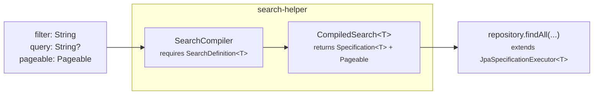

# search-helper

[](https://github.com/ggomarighetti/search-helper/actions/workflows/verify.yml)
[](https://adoptium.net/)
[](https://spring.io/projects/spring-boot)
[](LICENSE)
[](#project-status)

search-helper is a small contract layer for applications that receive search
parameters and need to compile them into Spring Data JPA artifacts. It does
not run the search itself. A search use case starts with a `SearchDefinition`.
It describes the public fields a client may filter or sort by, the operators
and value conversions allowed for each field, the paging and optional
application-defined query rules, and the limits that keep requests bounded. At
runtime, your application passes that definition, the incoming RSQL filter,
optional query parameter, and `Pageable` to `SearchCompiler`.



`SearchCompiler` validates the request against the `SearchDefinition` and the
configured protection policy. If the request is valid, the configured RSQL
backend translates the filter into a JPA
`Specification`; search-helper then returns that `Specification` together with
a validated `Pageable` as a `CompiledSearch<T>`. Your application decides when
to execute it by calling `repository.findAll(...)` on a repository that extends
`JpaSpecificationExecutor<T>`.

This lets a search API grow from simple filters to richer use cases without
losing the dynamic shape that makes RSQL useful, and without making endpoint
code grow around every new parameter, operator, sort option, join, or query
rule. The contract keeps public field names, entity paths, operator support,
value conversion, paging, sorting, optional query behavior, mandatory
predicates, and protection limits in one declared model, so each request can be
validated and customized before your repository receives the resulting
`Specification` and `Pageable`.

> Under the hood, `search-helper` builds on
> [perplexhub/rsql-jpa-specification](https://github.com/perplexhub/rsql-jpa-specification)
> for the RSQL-to-JPA `Specification` translation. It also uses
> [nstdio/rsql-parser](https://github.com/nstdio/rsql-parser), a fork of
> [jirutka/rsql-parser](https://github.com/jirutka/rsql-parser), the original
> RSQL parser project. This library adds an application contract, validation,
> and protection layer around those foundations.

[Example](#example) |
[About RSQL](#about-rsql) |
[Field Capabilities](#field-capabilities) |
[Protection Policy](#protection-policy) |
[Errors](#errors) |
[Extension Points](#extension-points)

## Example

The whole flow is a regular repository plus an application-owned search use case.

### Repository

```java
public interface ProductRepository
        extends JpaRepository<Product, UUID>,
                JpaSpecificationExecutor<Product> {
}
```

### Application Use Case

```java
@Service
@Transactional(readOnly = true)
@RequiredArgsConstructor
public class ProductSearchUseCase {

    private final SearchCompiler searchCompiler;
    private final ProductRepository productRepository;

    private static final SearchDefinition<Product> PRODUCT_DEFINITION =
            SearchDefinition.builder()
                    .entity(Product.class)
                    .fields(fields -> {
                        fields.add("id", UUID.class)
                                .sortable();

                        fields.add("name", String.class)
                                .searchable();

                        fields.add("price", BigDecimal.class)
                                .filterable(filter -> filter
                                        .withDefaults()
                                        .deny(IN)
                                        .allow(IS_NULL))
                                .sortable();

                        fields.add("category", String.class)
                                .path("category.name")
                                .filterable()
                                .sortable(sort -> sort.allow(ASC));
                    })
                    .query(query -> query
                            .rule(new SizeDef().min(3).max(80))
                            .specification(ProductSpecs::queryByNameOrSku))
                    .paging(paging -> paging
                            .size(size -> size.rule(new MaxDef().value(50))))
                    .build();

    public Page<Product> execute(String filter, String query, Pageable pageable) {
        CompiledSearch<Product> search =
                searchCompiler.compile(filter, query, pageable, PRODUCT_DEFINITION);

        return productRepository.findAll(search.specification(), search.pageable());
    }
}
```

## About RSQL

RSQL is the URL filter syntax used by the library. It is documented by the
[original RSQL parser project](https://github.com/jirutka/rsql-parser), and this
project currently uses the maintained
[nstdio parser fork](https://github.com/nstdio/rsql-parser). JPA predicate
generation is delegated to
[Perplexhub rsql-jpa](https://github.com/perplexhub/rsql-jpa-specification).

```text
name=ilike=phone;price=ge=500
status=in=(ACTIVE,DRAFT)
```

## Field Capabilities

Every declared field starts with filtering and sorting disabled.

```java
fields.add("name", String.class);       // exposed metadata only
fields.add("name", String.class).filterable();
fields.add("name", String.class).sortable();
fields.add("name", String.class).searchable();
```

- `filterable()` enables the restrictive default operator profile for the Java type.
- `sortable()` allows ascending and descending sorting.
- `searchable()` combines `filterable()` and `sortable()`.
- `filterable(customizer)` starts with an empty whitelist unless
  `withDefaults()` is called.

```java
fields.add("name", String.class)
        .filterable(filter -> filter
                .withDefaults()
                .deny(IN)
                .allow(IS_NULL));
```

Default operator profiles are type-aware:

| Field type | Default profile |
|---|---|
| Text | equality, lists, LIKE, and case-insensitive operators |
| Boolean | equality and inequality |
| Enum, UUID, and exact scalar types | equality and lists |
| Numbers and temporal types | equality, lists, ordering, and ranges |

Null operators are never included by default. Opt into `IS_NULL` or `NOT_NULL`
only where nullability is part of the public API.

## Validate Filter Values

Allowed operators can validate each converted value or the complete argument
list with programmatic Hibernate Validator constraints:

```java
fields.add("taxId", String.class)
        .filterable(filter -> filter
                .allow(EQUAL, operator -> operator
                        .each(each -> each
                                .rule(new SizeDef().min(11).max(11))
                                .rule(new PatternDef().regexp("\\d+"))))
                .allow(IN, operator -> operator
                        .args(args -> args.rule(new SizeDef().max(20)))
                        .each(each -> each
                                .rule(new SizeDef().min(11).max(11))
                                .rule(new PatternDef().regexp("\\d+")))));
```

Values are converted to the field type before validation. Invalid UUIDs, enums,
numbers, dates, and custom converted values become structured RSQL validation
errors instead of persistence failures.

## Free-Text Query

RSQL filtering and free-text search are separate concerns. The library validates
the query text and delegates its persistence semantics to your own
`Specification` factory:

```java
private static final SearchDefinition<Product> PRODUCT_DEFINITION =
        SearchDefinition.builder()
                .entity(Product.class)
                .query(query -> query
                        .rule(new SizeDef().min(3).max(80))
                        .specification(ProductSpecifications::matchesTerm))
                .paging()
                .build();
```

```java
CompiledSearch<Product> compiled = searchCompiler.compile(
        filter,
        query,
        pageable,
        PRODUCT_DEFINITION);
```

Your application can implement free-text search with PostgreSQL full-text
search, database functions, normalized columns, or ordinary Criteria API
predicates. `search-helper` does not force a search strategy.

## Aliases, Relations, and Inheritance

Expose stable API names without leaking entity structure:

```java
fields.add("customerName", String.class)
        .filterable(filter -> filter
                .path("customer.name")
                .allow(EQUAL))
        .sortable(sort -> sort
                .path("customer.sortName"));
```

A shared `.path(...)` can be used when filtering and sorting target the same
attribute.

Collection-valued filter paths are detected automatically:

```java
fields.add("reviewRating", Integer.class)
        .path("reviews.rating")
        .filterable(filter -> filter.allow(GREATER_THAN_OR_EQUAL));
```

When such a selector is present in the filter, the generated query uses
`distinct(true)` to prevent duplicate root rows. Sorting through collection
paths is rejected.

Subtype-only fields are supported through JPA `treat`:

```java
fields.add("birthDate", LocalDate.class)
        .subtype(NaturalPerson.class)
        .filterable()
        .sortable();
```

Definition paths are checked against Java properties while the DSL is built and
against the JPA metamodel when first compiled in a JPA application.

## Keep Business Rules Outside Client RSQL

Tenant isolation, authorization, visibility, and other mandatory predicates
should remain application-owned specifications:

```java
CompiledSearch<Product> compiled = searchCompiler.compile(
        filter,
        query,
        pageable,
        PRODUCT_DEFINITION,
        belongsToTenant(tenantId),
        visibleTo(currentUser),
        notDeleted());
```

All supplied specifications are combined with the validated RSQL and free-text
specifications using logical `AND`. Clients cannot remove or override them.

## Protection Policy

The library ships with bounded defaults. Override only the limits appropriate
for your data model and traffic:

```yaml
search:
  helper:
    rsql:
      max-length: 1000
      max-parentheses-depth: 6
      max-nodes: 40
      max-depth: 6
    filter:
      max-comparisons: 12
      max-comparisons-per-selector: 4
      max-arguments-total: 40
      max-argument-length: 120
      max-in-values: 20
      max-or-branches: 8
      max-joined-paths: 3
      max-to-many-paths: 1
    paging:
      max-page: 100
      max-size: 50
      max-offset: 2500
      allow-unpaged: false
    sorting:
      max-orders: 3
      max-relation-orders: 1
    query:
      max-length: 100
    paths:
      max-depth: 3
```

Protection covers:

- raw RSQL length and parenthesis nesting;
- AST nodes, depth, and logical children;
- comparisons per request and per selector;
- argument count, total count, and length;
- `IN`, `NOT IN`, range, negation, wildcard, and OR complexity;
- joined and to-many paths;
- page, size, offset, unpaged requests, and count-query topology;
- sort count, relation sorts, case handling, and null handling;
- risky combinations of query, relation sorting, to-many filtering, and unpaged requests.

Endpoint-specific limits can partially overlay the global policy:

```java
SearchDefinition.builder()
        .entity(Product.class)
        .limits(limits -> limits
                .filter(filter -> filter
                        .maxComparisons(8)
                        .maxInValues(10))
                .paging(paging -> paging
                        .maxSize(25)))
        .paging()
        .build();
```

Customizer-based limits replace only the values explicitly changed. Passing a
complete `SearchPolicy` replaces the global policy for that definition.

Use the auto-configured `SearchDefinitionFactory` when definitions must inherit
the global path-depth policy during construction:

```java
SearchDefinition<Product> definition = searchDefinitionFactory.builder()
        .entity(Product.class)
        .fields(fields -> fields.add("country", String.class)
                .path("supplier.address.countryCode")
                .filterable())
        .paging()
        .build();
```

## Errors

Validation failures expose stable codes and safe details suitable for an API
error mapper:

| Exception | Common codes |
|---|---|
| `RsqlFilterValidationException` | `RSQL_PARSE_ERROR`, `RSQL_RULES_FORBIDDEN`, `RSQL_LIMIT_EXCEEDED` |
| `SearchPageableValidationException` | `PAGE_RULES_FORBIDDEN`, `PAGE_LIMIT_EXCEEDED`, `SORT_RULES_FORBIDDEN`, `SORT_LIMIT_EXCEEDED` |
| `SearchQueryValidationException` | `QUERY_RULES_FORBIDDEN` |
| `SearchProtectionException` | `SEARCH_PROTECTION_RULE_EXCEEDED` |
| `SearchDefinitionValidationException` | `PATH_LIMIT_EXCEEDED`, `JPA_PATH_UNRESOLVED`, and RSQL configuration codes |

RSQL errors can identify the selector, operator, argument index, AST path, and
failed validation constraint. Page, size, and query violations expose safe
`RuleViolation` values.

Applications will normally map request validation and protection exceptions to
HTTP `400`. Definition validation errors indicate an application configuration
problem and should fail loudly.

## Main API

| Type | Purpose |
|---|---|
| `SearchDefinition<T>` | Immutable contract for one entity and search use case |
| `SearchCompiler` | Validates and compiles the complete request |
| `CompiledSearch<T>` | Resulting `Specification<T>` and validated `Pageable` |
| `SearchPolicy` | Global and local protection limits |
| `SearchDefinitionFactory` | Creates definitions with application-wide path limits |
| `RsqlOperators` | Logical identifiers for built-in operators |

For count-free flows, `SearchCompiler.compileSlice(...)` applies slice-specific
protection instead of page count-query restrictions.

## Extension Points

The everyday API is intentionally small, but the RSQL layer remains extensible:

| SPI | Use case |
|---|---|
| `SearchRsqlEngineCustomizer` | Customize the auto-configured engine |
| `RsqlOperatorDescriptor` | Register parser symbols, arity, conversion type, and a custom JPA predicate |
| `RsqlBackendAdapter` | Replace the Perplexhub-backed compiler |
| `RsqlParserFactory` | Replace parser construction |
| `SearchDefinitionValidator` | Add runtime definition checks |
| `ConversionService` | Add application-specific value conversion |

The default backend is implemented with
[Perplexhub rsql-jpa](https://github.com/perplexhub/rsql-jpa-specification).
`search-helper` deliberately builds on that work instead of replacing its
RSQL-to-JPA translation.

## Project Status

`search-helper` is currently a pre-release project:

- current version: `0.1.0-SNAPSHOT`;
- no Maven Central release has been published yet;
- the public API may still evolve before `1.0`;
- Spring Boot configuration metadata is included in the generated JAR;
- the implementation is covered by unit, fuzz/property-style, and PostgreSQL
  integration tests.

## Build

Run the complete verification suite:

```bash
./mvnw verify
```

PostgreSQL integration tests use Testcontainers, so Docker must be available.

Generate JaCoCo coverage for unit and integration tests:

```bash
./mvnw -Pcoverage verify
```

The XML report is written to `target/site/jacoco/jacoco.xml`; the HTML report
is written to `target/site/jacoco/index.html`. CI uploads the JaCoCo report and
JUnit XML test results to Codecov, and runs SonarQube Cloud analysis when the
repository has a `SONAR_TOKEN` secret configured.

Verify public Javadocs and release checks:

```bash
./mvnw -Prelease verify
```

## License

Released under the [MIT License](LICENSE).
