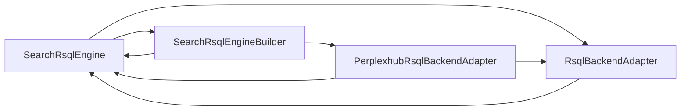
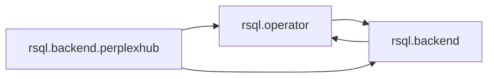

# SonarCloud Architecture Findings

Diagnostico de los seis hallazgos mostrados por SonarCloud Architecture para
`ggomarighetti_jpa-rsql-search`.

## Alcance Y Evidencia

- Branch analizada por SonarCloud: `master`.
- Commit analizado: `e7c236ac22592e7cce145fae6b8e7fb8c9829b22`.
- Fecha del analisis: `2026-06-19T05:23:40Z`.
- El `HEAD` local usado para este diagnostico coincide con ese commit.
- Se cruzaron los datos estructurales de SonarCloud con el codigo de
  `src/main/java` y con `SRC_HELP_MEMORY.md`.
- `SRC_HELP_MEMORY.md` no fue modificado.
- No hay una intended architecture definida; estos resultados describen la
  arquitectura actual inferida por SonarCloud.

SonarCloud distingue:

- `Tangle`: clases realmente incluidas en dependencias ciclicas.
- `Weak tangle`: conjunto cercano a formar ciclos o que forma ciclos al
  observar las dependencias entre paquetes, aunque no todas sus clases sean
  individualmente ciclicas.
- `Oversized`: contenedor con demasiadas hojas respecto del modelo estructural.
- `Split responsibility`: paquete cuyas clases forman fragmentos internos
  desconectados, senal de mas de una responsabilidad.

## Resumen

| # | Categoria | Hallazgo exacto | Alcance |
|---|---|---|---|
| 1 | Flaw / Tangle | Motor, builder y backend RSQL se referencian circularmente | 4 clases, 3 paquetes |
| 2 | Flaw / Oversized | Paquete raiz `jparsqlsearch` | 56 clases hoja |
| 3 | Smell / Weak tangle | Modelo de definicion, filtering, validation y RSQL | 23 clases, 11 paquetes |
| 4 | Smell / Weak tangle | Metadata de operadores y SPI de predicates JPA | 6 clases, 3 paquetes |
| 5 | Smell / Split responsibility | Paquete `exception` | 7 clases, 2 fragmentos |
| 6 | Smell / Split responsibility | Paquete `validation` | 3 clases, 2 fragmentos |

## 1. Flaw: Tangle RSQL

SonarCloud identifica exactamente estas clases:

- `rsql.SearchRsqlEngine`
- `rsql.SearchRsqlEngineBuilder`
- `rsql.backend.RsqlBackendAdapter`
- `rsql.backend.perplexhub.PerplexhubRsqlBackendAdapter`

### Ciclos concretos

Evidencia:

- `SearchRsqlEngine -> SearchRsqlEngineBuilder`: el metodo estatico
  `builder()` instancia el builder en
  `SearchRsqlEngine.java:47-48`; `defaults()` tambien lo atraviesa en
  `SearchRsqlEngine.java:56-57`.
- `SearchRsqlEngineBuilder -> SearchRsqlEngine`: `build()` instancia el motor
  en `SearchRsqlEngineBuilder.java:100-102`.
- `SearchRsqlEngine -> RsqlBackendAdapter`: el motor conserva el backend,
  delega `compile()` y llama `backend.validate(this, definition)` en
  `SearchRsqlEngine.java:28`, `SearchRsqlEngine.java:104-105` y
  `SearchRsqlEngine.java:122`.
- `RsqlBackendAdapter -> SearchRsqlEngine`: el SPI recibe el motor completo en
  `RsqlBackendAdapter.java:25`.
- `SearchRsqlEngineBuilder -> PerplexhubRsqlBackendAdapter`: el builder crea
  directamente el backend por defecto en `SearchRsqlEngineBuilder.java:21`.
- `PerplexhubRsqlBackendAdapter -> SearchRsqlEngine`: su validacion recibe el
  motor y consulta su registry en
  `PerplexhubRsqlBackendAdapter.java:64-66`.

### Interpretacion

Este es un ciclo real, no solo una heuristica. Hay dos bucles centrales:

1. `Engine -> Builder -> Engine`.
2. `Engine -> Backend SPI -> Engine`.

El backend Perplexhub une ambos porque es construido por el builder e inspecciona
el motor durante la validacion.

La dependencia mas costosa arquitectonicamente es que el SPI
`RsqlBackendAdapter` necesite el objeto `SearchRsqlEngine` completo. Un contexto
de validacion mas pequeno, por ejemplo registry y conversion metadata, permitiria
que el backend dependiera de contratos neutrales y no del orquestador.

## 2. Flaw: Oversized

El componente marcado no es una clase concreta. SonarCloud senala:

`io.github.ggomarighetti.jparsqlsearch`

Propiedad exacta del hallazgo:

- `leafCount = 56`

Esas 56 hojas son exactamente las 56 clases/interfaces/records de
`src/main/java`. La distribucion es:

| Paquete relativo | Clases |
|---|---:|
| `autoconfigure` | 3 |
| `compile` | 9 |
| `definition` | 4 |
| `exception` | 7 |
| `filter` | 5 |
| `jpa` | 1 |
| `page` | 1 |
| `policy` | 1 |
| `query` | 2 |
| `rsql` | 6 |
| `rsql.backend` | 3 |
| `rsql.backend.perplexhub` | 2 |
| `rsql.operator` | 6 |
| `rsql.parser` | 2 |
| `sort` | 1 |
| `validation` | 3 |

### Interpretacion

No significa que `SearchPolicy`, `SearchCompiler` u otra clase sea un "god
class". El contenedor raiz acumula demasiadas hojas para el umbral estadistico
de SonarCloud.

Es un indicador de granularidad de la jerarquia. La respuesta razonable seria
introducir agrupaciones intermedias que representen capas o capacidades reales,
por ejemplo API/modelo, runtime/compiler e infraestructura/backend. Mover clases
solo para reducir el contador podria empeorar el API publico y no resolver los
ciclos.

## 3. Smell: Weak Tangle Principal

SonarCloud agrupa 23 clases distribuidas en 11 paquetes.

### Clases exactas

`definition`:

- `SearchDefinition`
- `SearchField`
- `SearchPath`

`filter`:

- `SearchFiltering`
- `FilterOperator`
- `DefaultFilterOperators`
- `FilterValidationError`

`query`:

- `SearchQuery`

`page`:

- `SearchPaging`

`sort`:

- `SearchSorting`

`validation`:

- `HibernateRuleValidator`
- `RuleViolation`
- `SearchDefinitionValidator`

`exception`:

- `RsqlFilterValidationException`
- `SearchDefinitionValidationException`
- `SearchPageableValidationException`
- `SearchQueryValidationException`

`rsql`:

- `SearchRsqlEngine`
- `RsqlCompilationRequest`

`rsql.operator`:

- `RsqlOperator`
- `RsqlOperators`

`rsql.backend`:

- `RsqlBackendAdapter`

`rsql.backend.perplexhub`:

- `PerplexhubRsqlBackendAdapter`

### Dependencias que lo forman

Los bucles mas claros al nivel de paquetes son:

- `definition <-> filter`:
  `SearchField` contiene `SearchFiltering`
  (`SearchField.java:21`, `SearchField.java:165-170`), mientras
  `SearchFiltering` usa `definition.SearchPath`
  (`SearchFiltering.java:3`, `SearchFiltering.java:312-313`).
- `definition <-> sort`:
  `SearchField` contiene `SearchSorting`
  (`SearchField.java:22`, `SearchField.java:199-204`), mientras
  `SearchSorting` usa `definition.SearchPath`
  (`SearchSorting.java:3`, `SearchSorting.java:226-227`).
- `definition -> query -> validation -> definition`:
  `SearchDefinition` contiene `SearchQuery`
  (`SearchDefinition.java:30`, `SearchDefinition.java:291-306`);
  `SearchQuery` usa `HibernateRuleValidator`
  (`SearchQuery.java:3`, `SearchQuery.java:21`);
  `SearchDefinitionValidator` vuelve a depender de `SearchDefinition`
  (`SearchDefinitionValidator.java:3`, `SearchDefinitionValidator.java:13`).
- `definition -> page -> validation -> definition`:
  `SearchDefinition` contiene `SearchPaging`
  (`SearchDefinition.java:29`, `SearchDefinition.java:275-280`);
  `SearchPaging` usa `HibernateRuleValidator`
  (`SearchPaging.java:3`, `SearchPaging.java:17-18`).
- `rsql <-> rsql.backend`: es el ciclo real entre
  `SearchRsqlEngine` y `RsqlBackendAdapter` descrito en el tangle.
- `exception -> validation`: pageable y query exceptions exponen
  `RuleViolation` en
  `SearchPageableValidationException.java:3` y
  `SearchQueryValidationException.java:3`.

### Interpretacion

No hay un unico ciclo de 23 clases. SonarCloud detecta una red muy cercana a
ser ciclica porque las fronteras de paquetes no expresan una direccion estable:

- `definition` compone objetos de feature.
- Esos objetos de feature vuelven a usar utilidades de `definition`.
- `validation` contiene tanto infraestructura generica como un SPI que depende
  del modelo de definicion.
- RSQL y su backend se referencian mutuamente.

El nucleo del smell es de ownership y packaging. `SearchPath` funciona como
servicio transversal pero vive dentro de `definition`; y `validation` mezcla
Bean Validation generico con validacion runtime de `SearchDefinition`.

## 4. Smell: Weak Tangle De Operadores Y Backend

SonarCloud identifica estas seis clases:

`rsql.operator`:

- `RsqlOperator`
- `RsqlOperatorDescriptor`
- `RsqlOperatorRegistry`

`rsql.backend`:

- `RsqlJpaPredicateFactory`
- `RsqlJpaPredicateContext`

`rsql.backend.perplexhub`:

- `PerplexhubRsqlBackendAdapter`

### Ciclo de paquetes

Evidencia:

- `operator -> backend`: `RsqlOperatorDescriptor` guarda y publica
  `RsqlJpaPredicateFactory` en
  `RsqlOperatorDescriptor.java:4`, `RsqlOperatorDescriptor.java:18`,
  `RsqlOperatorDescriptor.java:108` y
  `RsqlOperatorDescriptor.java:207-208`.
- `backend -> operator`: `RsqlJpaPredicateContext` incluye un
  `RsqlOperator` en `RsqlJpaPredicateContext.java:3` y
  `RsqlJpaPredicateContext.java:32`.
- `perplexhub -> operator/backend`: el adapter usa descriptor, registry,
  factory y context en `PerplexhubRsqlBackendAdapter.java:10-17` y
  `PerplexhubRsqlBackendAdapter.java:87-121`.

### Interpretacion

Este smell es mas concentrado y accionable que el weak tangle principal. La
metadata de un operador, que parece backend-neutral, contiene directamente una
factory JPA. A la vez, el contexto JPA vuelve a depender del identificador de
operador.

Una frontera mas clara separaria:

- identidad, simbolos, aridad y conversion del operador;
- binding opcional de ejecucion JPA;
- implementacion Perplexhub.

## 5. Smell: Split Responsibility En `exception`

SonarCloud senala:

`io.github.ggomarighetti.jparsqlsearch.exception`

Propiedades:

- 7 clases.
- 2 fragmentos.
- Profundidad maxima: 5.

### Fragmento 1: errores de validacion

- `RsqlFilterValidationException`
- `RsqlValidationError`
- `SearchDefinitionValidationException`
- `SearchPageableValidationException`
- `SearchQueryValidationException`
- `ValidationExceptionSupport`

Estas clases estan conectadas por DTOs de error, `RuleViolation` y el helper
comun de codigos/listas. Por ejemplo:

- `RsqlFilterValidationException` usa `RsqlValidationError` y
  `ValidationExceptionSupport` en
  `RsqlFilterValidationException.java:19` y
  `RsqlFilterValidationException.java:70-71`.
- Las excepciones de definition, pageable y query usan
  `ValidationExceptionSupport`.

### Fragmento 2: proteccion de recursos

- `SearchProtectionException`

`SearchProtectionException` es independiente de todo el fragmento de
validacion. Modela una regla de hardening con `rule`, `actual` y `limit`
(`SearchProtectionException.java:13-19`) y no usa
`ValidationExceptionSupport`, `RuleViolation` ni DTOs RSQL.

### Interpretacion

El paquete agrupa por mecanismo Java, "exceptions", pero contiene dos dominios:

1. Errores de entrada/definicion con detalles de validacion.
2. Violaciones de limites de proteccion del request.

Separarlos expresaria mejor la responsabilidad, aunque mover excepciones
publicas cambia nombres de package y por lo tanto es una decision de
compatibilidad de API.

## 6. Smell: Split Responsibility En `validation`

SonarCloud senala:

`io.github.ggomarighetti.jparsqlsearch.validation`

Propiedades:

- 3 clases.
- 2 fragmentos.
- Profundidad maxima: 5.

### Fragmento 1: Bean Validation

- `HibernateRuleValidator`
- `RuleViolation`

`HibernateRuleValidator` produce `RuleViolation` en
`HibernateRuleValidator.java:83-93` y
`HibernateRuleValidator.java:109-114`.

### Fragmento 2: SPI de SearchDefinition

- `SearchDefinitionValidator`

`SearchDefinitionValidator` no depende del fragmento anterior. Es un contrato
runtime cuyo unico parametro es `SearchDefinition<?>`
(`SearchDefinitionValidator.java:3-13`).

### Interpretacion

El package mezcla dos significados distintos de "validation":

1. Adaptacion generica de Hibernate Validator y su DTO seguro.
2. Punto de extension para validar una definicion de busqueda completa.

Este hallazgo es preciso. El SPI podria pertenecer al area `definition` o a un
package de validacion de definiciones, dejando el adapter de Bean Validation en
un package separado.

## Prioridad Recomendada

1. Resolver primero el tangle real entre engine, builder y backend.
2. Revisar el weak tangle de operadores/backend, porque revela una frontera JPA
   dentro de metadata que aparenta ser neutral.
3. Disenar una direccion de dependencias para `definition`, `filter`, `sort`,
   `page`, `query` y `validation` antes de mover clases del weak tangle grande.
4. Separar responsabilidades de `validation` y `exception` solo con una
   estrategia de compatibilidad para el API publico.
5. Tratar `oversized` como senal de jerarquia, no como orden de dividir clases
   arbitrariamente.

## Enlaces De SonarCloud

- [Architecture dashboard](https://sonarcloud.io/project/architecture?id=ggomarighetti_jpa-rsql-search)
- [Tangles](https://sonarcloud.io/project/architecture/tangles?id=ggomarighetti_jpa-rsql-search)
- [Oversized](https://sonarcloud.io/project/architecture/oversized?id=ggomarighetti_jpa-rsql-search)
- [Weak tangles](https://sonarcloud.io/project/architecture/weak-tangles?id=ggomarighetti_jpa-rsql-search)
- [Split responsibilities](https://sonarcloud.io/project/architecture/split-responsibility?id=ggomarighetti_jpa-rsql-search)
- [Documentacion oficial de Sonar Architecture](https://docs.sonarsource.com/sonarqube-cloud/architecture)
