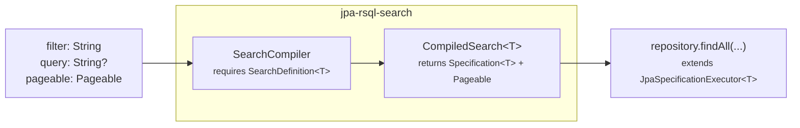

# jpa-rsql-search

[](https://github.com/ggomarighetti/jpa-rsql-search/actions/workflows/verify.yml)
[](https://central.sonatype.com/artifact/io.github.ggomarighetti/jpa-rsql-search-spring-boot-starter)
[](https://javadoc.io/doc/io.github.ggomarighetti/jpa-rsql-search-api)
[](https://github.com/ggomarighetti/jpa-rsql-search/releases)
[](https://scorecard.dev/viewer/?uri=github.com/ggomarighetti/jpa-rsql-search)
[](https://adoptium.net/)
[](https://spring.io/projects/spring-boot)
[](../LICENSE)
[](#project-status)

`jpa-rsql-search` is a small contract layer for Spring applications that accept
dynamic search input and need to turn it into Spring Data JPA artifacts. It does
not run the query itself. Your application declares a `SearchDefinition<T>` for
one search use case, passes the incoming RSQL filter, optional query text,
and `Pageable` to `SearchCompiler`, and receives a validated
`CompiledSearch<T>` containing a `Specification<T>` and a safe `Pageable`.



The definition is the application-owned boundary: public field names, entity
paths, allowed operators, value conversion and validation rules, paging,
sorting, optional query behavior, mandatory predicates, and protection
limits live in one declared model. Each request is validated against that model
before a repository sees the generated `Specification` and `Pageable`.

That lets a search API grow from a handful of filters to richer query use cases
without adding endpoint-specific parameters for every field, join, operator, or
sort order. Clients keep the flexible shape that makes RSQL useful, while the
server keeps a narrow and explicit contract around what can actually be queried.

## What is RSQL?

RSQL is a compact URL filter syntax for expressing comparisons and boolean
logic. It is useful when an endpoint needs dynamic filtering but should not grow
a new query parameter for every possible field/operator pair.

```text
name=ilike=phone;price=ge=500
status=in=(ACTIVE,DRAFT)
(brand==Acme,brand==Omni);deleted==false
```

In RSQL, `;` means logical `AND`, `,` means logical `OR`, selectors identify
public fields, and comparison operators such as `==`, `=in=`, `=ge=`, or
`=ilike=` describe the filter operation. This project uses
[nstdio/rsql-parser](https://github.com/nstdio/rsql-parser), a maintained fork
of the original [jirutka/rsql-parser](https://github.com/jirutka/rsql-parser).

## Why not use rsql-jpa-specification directly?

You can, and this library deliberately builds on
[perplexhub/rsql-jpa-specification](https://github.com/perplexhub/rsql-jpa-specification)
for the RSQL-to-JPA `Specification` translation.

`jpa-rsql-search` adds the application contract around that translation. It
lets you expose stable public aliases instead of entity paths, decide which
fields can be filtered or sorted, restrict operators and sort directions per
field, convert and validate values with Spring and Hibernate Validator, attach
mandatory application-owned `Specification<T>` predicates, enforce bounded
parser/filter/paging/sorting/query/path policies, and return structured
validation details that fit naturally into API error DTOs. In other words,
Perplexhub handles the low-level RSQL-to-JPA work; this library handles the
public search contract around it.

## Contents

[Installation](#installation) |
[Quick Example](#quick-example) |
[API Reference](#api-reference) |
[Configuration](#configuration) |
[Error Handling](#error-handling) |
[Customization](#customization) |
[Security](#security) |
[Project Status](#project-status)

## Installation

Maven:

```xml
<dependency>
  <groupId>io.github.ggomarighetti</groupId>
  <artifactId>jpa-rsql-search-spring-boot-starter</artifactId>
  <version>2.0.0</version>
</dependency>
```

Gradle Kotlin DSL:

```kotlin
implementation("io.github.ggomarighetti:jpa-rsql-search-spring-boot-starter:2.0.0")
```

The starter brings in the API, core compiler, JPA validation, and default
Perplexhub backend. Applications that do not use Spring Boot can depend on the
individual `jpa-rsql-search-*` modules instead.

## Quick Example

The runtime flow is a regular Spring Data repository plus an application-owned
search definition.

```java
public interface ProductRepository
        extends JpaRepository<Product, UUID>,
                JpaSpecificationExecutor<Product> {
}
```

```java
@Service
@Transactional(readOnly = true)
@RequiredArgsConstructor
public class ProductSearchUseCase {

    private final SearchCompiler searchCompiler;
    private final ProductRepository productRepository;

    private static final SearchDefinition<Product> PRODUCT_DEFINITION =
            SearchDefinition.builder()
                    .entity(Product.class)
                    .fields(fields -> {
                        fields.add("id", UUID.class)
                                .sortable();

                        fields.add("name", String.class)
                                .searchable();

                        fields.add("price", BigDecimal.class)
                                .filterable(filter -> filter
                                        .withDefaults()
                                        .deny(IN)
                                        .allow(IS_NULL))
                                .sortable();

                        fields.add("category", String.class)
                                .path("category.name")
                                .filterable()
                                .sortable(sort -> sort.allow(ASC));
                    })
                    .query(query -> query
                            .rule(new SizeDef().min(3).max(80))
                            .specification(ProductSpecs::queryByNameOrSku))
                    .paging(paging -> paging
                            .size(size -> size.rule(new MaxDef().value(50))))
                    .build();

    public Page<Product> execute(String filter, String query, Pageable pageable) {
        CompiledSearch<Product> search =
                searchCompiler.compile(filter, query, pageable, PRODUCT_DEFINITION);

        return productRepository.findAll(search.specification(), search.pageable());
    }
}
```

## API Reference

### Main Types

| Type | Purpose |
|---|---|
| `SearchDefinition<T>` | Immutable contract for one entity and search use case |
| `SearchDefinition.Factory` | Creates definitions with application-wide path limits |
| `SearchCompiler` | Validates and compiles a complete request |
| `CompiledSearch<T>` | Resulting `Specification<T>` and validated `Pageable` |
| `SearchPolicy` | Global and definition-local protection limits |
| `RsqlOperators` | Logical identifiers for built-in operators |

### SearchDefinition Builder

Start every definition by selecting the JPA root entity:

```java
SearchDefinition<Product> definition = SearchDefinition.builder()
        .entity(Product.class)
        .build();
```

In Spring Boot applications, prefer the auto-configured
`SearchDefinition.Factory` when definitions should inherit global path-depth
policy during construction:

```java
SearchDefinition<Product> definition = searchDefinitionFactory.builder()
        .entity(Product.class)
        .fields(fields -> fields.add("country", String.class)
                .path("supplier.address.countryCode")
                .filterable())
        .paging()
        .build();
```

Definitions are designed to be reused. Prefer static fields, singleton beans, or
other long-lived holders instead of rebuilding the same definition for every
request. Definitions that are built dynamically and then discarded implement
`AutoCloseable`; call `close()` after the last use to release Hibernate
Validator factories deterministically. Long-lived definitions can simply stay
open for the lifetime of the application.

Declare public fields inside `.fields(...)`. A field starts as metadata only;
filtering and sorting are disabled until enabled explicitly.

```java
SearchDefinition<Product> definition = SearchDefinition.builder()
        .entity(Product.class)
        .fields(fields -> {
            fields.add("name", String.class);       // exposed metadata only
            fields.add("sku", String.class).filterable();
            fields.add("price", BigDecimal.class).sortable();
            fields.add("category", String.class).searchable();
        })
        .build();
```

`fields.add(selector, type)` declares the stable public selector and the value
type used for conversion and validation. The selector is also the default entity
path. Use `.path(...)` to map a public selector to a different JPA path.

```java
fields.add("customerName", String.class)
        .path("customer.name")
        .filterable()
        .sortable();
```

Filtering and sorting can use separate paths when the read model needs it:

```java
fields.add("customer", String.class)
        .filterable(filter -> filter
                .path("customer.name")
                .allow(EQUAL, IGNORE_CASE_LIKE))
        .sortable(sort -> sort
                .path("customer.sortName")
                .allow(ASC));
```

Subtype-only fields are supported through JPA `treat` by declaring
`.subtype(...)`:

```java
fields.add("birthDate", LocalDate.class)
        .subtype(NaturalPerson.class)
        .filterable()
        .sortable();
```

Definition paths are checked against Java properties while the DSL is built and,
in JPA applications, against the JPA metamodel when first compiled. Collection
element types can be resolved from concrete generic supertypes and bounded type
variables, such as `List<T extends Line>`.

### Filtering

`.filterable()` enables the restrictive default operator profile for the field
type. `.filterable(filter -> ...)` starts with an empty whitelist unless
`filter.withDefaults()` is called.

```java
fields.add("price", BigDecimal.class)
        .filterable(filter -> filter
                .withDefaults()
                .deny(IN)
                .allow(IS_NULL));
```

The filtering DSL supports:

| Method | Effect |
|---|---|
| `filter.path(...)` | Overrides the filtering JPA path |
| `filter.withDefaults()` | Adds the type-aware default operator profile |
| `filter.allow(operator...)` | Allows one or more operators without extra rules |
| `filter.allow(operator, rules -> ...)` | Allows an operator and adds validation |
| `filter.allow(operator, argumentType, rules -> ...)` | Uses an explicit conversion/validation type |
| `filter.deny(operator...)` | Removes operators from the effective whitelist |

Default operator profiles are type-aware:

| Field type | Default profile |
|---|---|
| Text | equality, lists, LIKE, and case-insensitive operators |
| Boolean | equality and inequality |
| Enum, UUID, and exact scalar types | equality and lists |
| Numbers and temporal types | equality, lists, ordering, and ranges |

Null operators are never included by default. Opt into `IS_NULL` or `NOT_NULL`
only where nullability is part of the public API.

Built-in logical operators are available through `RsqlOperators`:

```java
EQUAL, NOT_EQUAL, GREATER_THAN, GREATER_THAN_OR_EQUAL,
LESS_THAN, LESS_THAN_OR_EQUAL, IN, NOT_IN,
IS_NULL, NOT_NULL, LIKE, NOT_LIKE, IGNORE_CASE,
IGNORE_CASE_LIKE, IGNORE_CASE_NOT_LIKE, BETWEEN, NOT_BETWEEN
```

Operator declarations can validate each converted argument with `each(...)` and
the complete converted argument list with `args(...)`. Rules are declared with
Hibernate Validator's programmatic constraint definitions.

```java
fields.add("taxId", String.class)
        .filterable(filter -> filter
                .allow(EQUAL, operator -> operator
                        .each(each -> each
                                .rule(new SizeDef().min(11).max(11))
                                .rule(new PatternDef().regexp("\\d+"))))
                .allow(IN, operator -> operator
                        .args(args -> args.rule(new SizeDef().max(20)))
                        .each(each -> each
                                .rule(new SizeDef().min(11).max(11))
                                .rule(new PatternDef().regexp("\\d+")))));
```

Values are converted before validation. Invalid UUIDs, enums, numbers, dates,
or custom converted values become structured RSQL validation errors instead of
persistence failures.

Collection-valued filter paths are detected automatically:

```java
fields.add("reviewRating", Integer.class)
        .path("reviews.rating")
        .filterable(filter -> filter.allow(GREATER_THAN_OR_EQUAL));
```

When a to-many selector appears in the filter, the generated query uses
`distinct(true)` to prevent duplicate root rows. Sorting through collection
paths is rejected.

### Sorting

`.sortable()` enables both `ASC` and `DESC` directions on the effective path.
`.sortable(sort -> ...)` customizes the sort contract.

```java
fields.add("name", String.class)
        .sortable(sort -> sort
                .allow(ASC)
                .allowIgnoreCase()
                .allowNullHandling(NULLS_LAST));
```

The sorting DSL supports:

| Method | Effect |
|---|---|
| `sort.path(...)` | Overrides the sorting JPA path |
| `sort.allow(...)` | Restricts accepted `Sort.Direction` values |
| `sort.allowIgnoreCase()` | Allows Spring Data case-insensitive sort orders |
| `sort.allowNullHandling(...)` | Allows explicit Spring Data null handling modes |

Global sorting policy can still reject relation sorting, too many orders,
case-insensitive orders, explicit null handling, or to-many paths.

### Searchable Fields

`.searchable()` is a convenience method that enables default filtering and both
sort directions:

```java
fields.add("name", String.class).searchable();
```

It is equivalent to:

```java
fields.add("name", String.class)
        .filterable()
        .sortable();
```

### Query Text

RSQL filtering and the optional `query` parameter are separate concerns. The
library validates query text and delegates persistence semantics to your own
`Specification<T>` factory.

```java
SearchDefinition<Product> definition = SearchDefinition.builder()
        .entity(Product.class)
        .query(query -> query
                .rule(new SizeDef().min(3).max(80))
                .specification(ProductSpecifications::matchesTerm))
        .paging()
        .build();
```

Your application can implement query matching with database functions,
normalized columns, indexed expressions, or ordinary Criteria API predicates.
`jpa-rsql-search` does not force a search strategy.

### Paging

`.paging()` enables paging with definition-level default rules. `.paging(...)`
adds Hibernate Validator rules for page number and page size.

```java
SearchDefinition<Product> definition = SearchDefinition.builder()
        .entity(Product.class)
        .paging(paging -> paging
                .page(page -> page.rule(new MinDef().value(0)))
                .size(size -> size.rule(new MaxDef().value(50))))
        .build();
```

Definition rules are applied in addition to global paging policy.

### Local Policy Overrides

`.limits(...)` customizes the protection policy for one definition. Customizer
based limits overlay only the values explicitly changed on top of the compiler's
global policy.

```java
SearchDefinition<Product> definition = SearchDefinition.builder()
        .entity(Product.class)
        .limits(limits -> limits
                .filter(filter -> filter
                        .maxComparisons(8)
                        .maxInValues(10))
                .paging(paging -> paging
                        .maxSize(25)))
        .paging()
        .build();
```

Passing a complete `SearchPolicy` to `.limits(SearchPolicy)` replaces the global
policy for that definition.

### Runtime Compilation

Use `SearchCompiler` for complete request compilation. It coordinates filtering,
query text, paging, sorting, and cross-component protection rules.

```java
CompiledSearch<Product> search = searchCompiler.compile(
        filter,
        query,
        pageable,
        PRODUCT_DEFINITION);

return productRepository.findAll(search.specification(), search.pageable());
```

Repositories must extend `JpaSpecificationExecutor<T>` to execute the compiled
`Specification<T>`.

For count-free flows, use `compileSlice(...)`. It applies slice-specific
protection instead of page count-query restrictions.

```java
CompiledSearch<Product> search = searchCompiler.compileSlice(
        filter,
        query,
        pageable,
        PRODUCT_DEFINITION);

return productSliceQuery.fetchSlice(search.specification(), search.pageable());
```

The execution method is application-owned; use a repository/query path that
actually returns a slice without issuing a count query.

Tenant isolation, authorization, visibility, and other mandatory predicates
should remain application-owned specifications. Extra specifications passed to
`compile(...)` or `compileSlice(...)` are combined with the validated RSQL and
query specifications using logical `AND`.

```java
CompiledSearch<Product> search = searchCompiler.compile(
        filter,
        query,
        pageable,
        PRODUCT_DEFINITION,
        belongsToTenant(tenantId),
        visibleTo(currentUser),
        notDeleted());
```

Clients cannot remove or override those mandatory predicates.

## Configuration

Spring Boot auto-configuration binds global limits from the
`jpa.rsql.search` prefix and turns them into a `SearchPolicy`. Most
applications only override the few limits that should be tighter for their data
model or traffic profile:

```yaml
jpa:
  rsql:
    search:
      filter:
        max-comparisons: 16
        max-in-values: 25
      paging:
        max-size: 50
        max-offset: 2500
      query:
        max-length: 100
```

The generated JAR includes Spring Boot configuration metadata for the complete
property set. At a high level, the policy groups are:

| Group | Covers |
|---|---|
| `rsql` | Parser enablement, raw filter length, parenthesis depth, AST size and depth |
| `rsql.perplexhub` | Options for the bundled Perplexhub-backed JPA compiler |
| `filter` | Comparison counts, arguments, `IN`, `NOT IN`, ranges, negation, OR complexity, joins, and to-many filtering |
| `filter.like` | LIKE pattern length, literal length, wildcard placement/count, and case-insensitive LIKE support |
| `paging` | Page number, size, offset, unpaged requests, and page/slice topology |
| `sorting` | Sort order count, relation sorting, case handling, null handling, joins, and to-many rejection |
| `query` | Query text length and risky combinations with to-many filtering, relation sorting, or unpaged requests |
| `paths` | Maximum dotted path depth used while building definitions |

The built-in profile is intentionally bounded: RSQL is enabled with a
4096-character maximum, AST depth is capped at 8 with at most 48 nodes, filters
allow up to 24 comparisons and 50 `IN` values, page size defaults to a maximum
of 100 with a 5000-row offset cap, unpaged requests are disabled, sort orders
are capped at 3, to-many sorting is rejected, slice compilation is enabled, and
definition paths are capped at 3 segments.

When unpaged requests are enabled with `jpa.rsql.search.paging.allow-unpaged`
or a per-definition limit override, the compiler still does not return an
unbounded `Pageable`. It records the original unpaged input for protection
checks, translates allowed sort aliases, and returns `PageRequest.of(0,
defaultUnpagedSize, translatedSort)`. Use
`jpa.rsql.search.paging.default-unpaged-size` to choose that bounded page size.

Setting `jpa.rsql.search.rsql.enabled=false` disables the built-in RSQL engine,
Perplexhub backend, and related RSQL infrastructure. In that mode the
auto-configuration still creates `SearchDefinition.Factory`, but it creates
`SearchCompiler` only when the application provides its own `SearchRsqlEngine`
bean.

Per-use case `.limits(...)` overlays remain useful when one endpoint needs a
tighter profile than the global defaults:

```java
SearchDefinition<Product> definition = SearchDefinition.builder()
        .entity(Product.class)
        .limits(limits -> limits
                .filter(filter -> filter.maxComparisons(8))
                .paging(paging -> paging.maxSize(25)))
        .paging()
        .build();
```

## Error Handling

Request validation failures expose stable codes and safe details suitable for
API error DTOs.

| Exception | Common codes | Details |
|---|---|---|
| `RsqlFilterValidationException` | `RSQL_PARSE_ERROR`, `RSQL_RULES_FORBIDDEN`, `RSQL_LIMIT_EXCEEDED` | `errors()` returns `RsqlValidationError` values |
| `SearchPageableValidationException` | `PAGE_RULES_FORBIDDEN`, `PAGE_LIMIT_EXCEEDED`, `SORT_RULES_FORBIDDEN`, `SORT_LIMIT_EXCEEDED` | `violations()` returns `RuleViolation` values for page/size rules |
| `SearchQueryValidationException` | `QUERY_RULES_FORBIDDEN` | `violations()` returns `RuleViolation` values for query rules |
| `SearchProtectionException` | `SEARCH_PROTECTION_RULE_EXCEEDED` | `rule()`, `actual()`, and `limit()` identify the exceeded protection rule |
| `SearchDefinitionValidationException` | `PATH_LIMIT_EXCEEDED`, `JPA_PATH_UNRESOLVED`, `RSQL_CONFIGURATION_INVALID`, `RSQL_OPERATOR_NOT_REGISTERED`, `RSQL_OPERATOR_NOT_EXECUTABLE`, `RSQL_OPERATOR_TYPE_MISMATCH`, `DEFAULT_OPERATORS_UNSUPPORTED_TYPE` | Configuration failure; usually not a client `400` |

`RsqlValidationError` can identify the AST location, selector, operator,
argument index, validation path, message, message template, and constraint.
`RuleViolation` is a serializable view of a Jakarta Bean Validation violation:
it includes path, message, template, and constraint type, but intentionally omits
the invalid value.

Protection limits are intentionally allowed to win over some semantic RSQL
errors. After an operator is registered and a selector is declared, the compiler
records comparison limits before selector-specific operator checks and argument
conversion/validation. For oversized or adversarial input, callers may therefore
receive `SearchProtectionException` instead of a more specific
`RsqlValidationError` such as operator-not-allowed or argument-rule-violation.

That makes custom rules declared with `SizeDef`, `PatternDef`, `MaxDef`, and
other Hibernate Validator definitions behave like normal DTO validation from an
API boundary perspective: you can transmit structured validation details to the
client without exposing raw request values.

```java
@RestControllerAdvice
class SearchExceptionHandler {

    @ExceptionHandler(RsqlFilterValidationException.class)
    ResponseEntity<ApiError> handleRsql(RsqlFilterValidationException exception) {
        return ResponseEntity.badRequest().body(ApiError.validation(
                exception.code(),
                exception.getMessage(),
                exception.errors()));
    }

    @ExceptionHandler(SearchPageableValidationException.class)
    ResponseEntity<ApiError> handlePageable(
            SearchPageableValidationException exception) {
        return ResponseEntity.badRequest().body(ApiError.validation(
                exception.code(),
                exception.getMessage(),
                exception.violations()));
    }

    @ExceptionHandler(SearchQueryValidationException.class)
    ResponseEntity<ApiError> handleQuery(SearchQueryValidationException exception) {
        return ResponseEntity.badRequest().body(ApiError.validation(
                exception.code(),
                exception.getMessage(),
                exception.violations()));
    }

    @ExceptionHandler(SearchProtectionException.class)
    ResponseEntity<ApiError> handleProtection(SearchProtectionException exception) {
        return ResponseEntity.badRequest().body(ApiError.validation(
                exception.code(),
                exception.getMessage(),
                Map.of(
                        "rule", exception.rule(),
                        "actual", exception.actual(),
                        "limit", exception.limit())));
    }
}
```

Applications will normally map request validation and protection exceptions to
HTTP `400`. `SearchDefinitionValidationException` indicates an application
configuration problem: unresolved entity paths, invalid custom operators,
unsupported default operator profiles, or incompatible conversion/backend
contracts should fail loudly during development, startup, or first use.

## Customization

The everyday API is intentionally small, but the RSQL layer remains extensible.

| Extension point | Use case |
|---|---|
| `SearchRsqlEngineCustomizer` | Customize the auto-configured RSQL engine |
| `RsqlOperatorDescriptor` | Register parser symbols, arity, conversion type, and custom JPA execution |
| `PerplexhubRsqlBackendOptions` | Tune the bundled Perplexhub adapter |
| `RsqlBackendAdapter` | Replace the Perplexhub-backed compiler |
| `RsqlParserFactory` | Replace parser construction |
| `SearchDefinitionValidator` | Add runtime definition checks |
| `ConversionService` / `Converter<String, T>` | Add application-specific value conversion |
| `jpa.rsql.search.rsql.perplexhub.*` | Configure the bundled Perplexhub backend |

`SearchRsqlEngine.builder()` starts with the built-in operator dialect. For a
strictly custom dialect, call `.withoutDefaultOperators()` before adding custom
`RsqlOperatorDescriptor` instances. In Spring Boot, a `SearchRsqlEngineCustomizer`
can do the same for the auto-configured engine.

### Perplexhub Backend

The default backend is `PerplexhubRsqlBackendAdapter`. It wraps Perplexhub's
`RSQLJPAPredicateConverter`, but it does not expose entity paths directly to the
client. The adapter receives the validated `SearchDefinition`, passes public
selector-to-JPA-path aliases to Perplexhub, applies the configured
`ConversionService`, forwards the backend options, and turns any descriptor with
`.jpaPredicate(...)` into a Perplexhub `RSQLCustomPredicate`.

That means there are two levels of operator customization:

- built-in operators such as `==`, `=in=`, `=ilike=`, and `=between=` are
  registered by the library and executed through Perplexhub's native support;
- application operators are registered with `RsqlOperatorDescriptor` and must
  provide `.jpaPredicate(...)` so the Perplexhub adapter knows how to build the
  JPA `Predicate`.

For a custom operator executed by the default backend, always declare:

- a logical `RsqlOperator`;
- one or more parser symbols;
- an arity;
- an `argumentType(...)` compatible with `Comparable`;
- a `jpaPredicate(...)` implementation.

`RsqlOperatorDescriptor.argumentType(...)` accepts any Java type so custom
backends can use application-specific value objects. The bundled Perplexhub
backend is stricter because `RSQLCustomPredicate` requires a `Comparable`
argument type; non-comparable argument types are supported only with a backend
that can execute them.

The predicate receives an `RsqlJpaPredicateContext` with the
`CriteriaBuilder`, resolved JPA `Path`, metamodel `Attribute`, converted
arguments, root/from, and logical operator. The same `ConversionService` is used
for library validation and Perplexhub execution, so conversion rules stay
consistent.

Backend options can be set with Spring properties:

```yaml
jpa:
  rsql:
    search:
      rsql:
        perplexhub:
          strict-equality: true
          like-escape-character: "!"
```

or by providing a bean:

```java
@Bean
PerplexhubRsqlBackendOptions perplexhubOptions() {
    return PerplexhubRsqlBackendOptions.builder()
            .strictEquality(true)
            .likeEscapeCharacter('!')
            .build();
}
```

If you need Perplexhub behavior that is not exposed by these options, replace
the `RsqlBackendAdapter` bean and compile `RsqlCompilationRequest<T>` yourself.

### Custom Operators

Create a logical `RsqlOperator`, describe its parser symbol and arity with
`RsqlOperatorDescriptor`, and register it through a Spring
`SearchRsqlEngineCustomizer` bean.

```java
@Configuration
class SearchOperatorsConfiguration {

    static final RsqlOperator STARTS_WITH = RsqlOperator.of("STARTS_WITH");

    @Bean
    SearchRsqlEngineCustomizer startsWithOperator() {
        return builder -> builder.operator(
                RsqlOperatorDescriptor.builder(STARTS_WITH)
                        .symbol("=startsWith=")
                        .arity(RsqlOperatorArity.exact(1))
                        .argumentType(String.class)
                        .jpaPredicate(context -> context.criteriaBuilder().like(
                                context.path().as(String.class),
                                context.argument(0) + "%"))
                        .build());
    }
}
```

Then allow the operator on specific fields:

```java
SearchDefinition<CatalogTextEntry> definition = SearchDefinition.builder()
        .entity(CatalogTextEntry.class)
        .fields(fields -> fields.add("code", String.class)
                .filterable(filter -> filter.allow(STARTS_WITH)))
        .paging()
        .build();
```

Custom operators are validated like built-in operators. With the default
Perplexhub backend, a registered operator that is not built in must have a JPA
predicate; otherwise the definition fails with
`RSQL_OPERATOR_NOT_EXECUTABLE`. If `.jpaPredicate(...)` is present,
`.argumentType(...)` is required so the backend can create the matching
Perplexhub custom predicate, and that type must implement `Comparable`.

### Custom Conversion

The engine uses one `ConversionService` for validation and backend compilation.
If your application exposes a unique `ConversionService` bean, auto-configuration
uses it. Otherwise, it builds an `ApplicationConversionService` and adds
application `Converter` beans.

```java
record Sku(String value) {
}

@Component
class SkuConverter implements Converter<String, Sku> {
    @Override
    public Sku convert(String source) {
        if (!source.startsWith("SKU")) {
            throw new IllegalArgumentException("SKU must start with SKU");
        }
        return new Sku(source);
    }
}
```

```java
SearchDefinition<CatalogItem> definition = SearchDefinition.builder()
        .entity(CatalogItem.class)
        .fields(fields -> fields.add("sku", Sku.class)
                .filterable(filter -> filter.allow(EQUAL)))
        .paging()
        .build();
```

Invalid converted values become `RSQL_ARGUMENT_CONVERSION_FAILED` validation
errors rather than persistence exceptions.

### Backend, Parser, and Definition Validation

Register a `RsqlBackendAdapter` bean to replace the default Perplexhub-backed
compiler, or a `RsqlParserFactory` through `SearchRsqlEngineCustomizer` to
replace parser construction. Register one or more `SearchDefinitionValidator`
beans to enforce additional runtime checks on completed definitions.

## Security

Report suspected vulnerabilities privately through
[GitHub Security Advisories](https://github.com/ggomarighetti/jpa-rsql-search/security/advisories/new);
do not open a public issue. The supported-version policy, response targets, and
disclosure process are documented in [SECURITY.md](SECURITY.md).

Release assets include SHA-256 checksums, CycloneDX SBOMs, build information,
and Sigstore attestations. Verification instructions are in
[RELEASE_SECURITY.md](RELEASE_SECURITY.md), and the project's OpenSSF
control mapping is in [OPENSSF.md](OPENSSF.md).

## Project Status

`jpa-rsql-search` is a modular 2.x library:

- current development line: `2.0.0`;
- releases are published as `io.github.ggomarighetti:jpa-rsql-search-*`
  modules, with `jpa-rsql-search-spring-boot-starter` as the usual entry point;
- the public API follows Semantic Versioning;
- Spring Boot configuration metadata is included in the generated JAR;
- the implementation is covered by unit, property, Jazzer, and
  PostgreSQL integration tests;
- Scorecard, CodeQL, OSV-Scanner, dependency review, SBOM generation, and
  reproducible-build checks run in GitHub Actions.

## Build

Run the complete verification suite:

```bash
./mvnw verify
```

PostgreSQL integration tests use Testcontainers, so Docker must be available.

Generate JaCoCo coverage for unit and integration tests:

```bash
./mvnw -Pcoverage verify
```

The aggregate XML report is written to
`integration-tests/target/site/jacoco-aggregate/jacoco.xml`. CI uploads JaCoCo
and JUnit results to Codecov, and runs SonarQube Cloud analysis when the
repository has a `SONAR_TOKEN` secret configured.

Verify public Javadocs and release checks:

```bash
./mvnw -Prelease verify
```

Generate CycloneDX SBOMs and reproducible-build metadata:

```bash
./mvnw -Psbom,reproducible -DskipTests package
```

## Contributing

Issues, bug reports, documentation improvements, and pull requests are welcome.
See [CONTRIBUTING.md](CONTRIBUTING.md) for the development workflow, review
policy, Conventional Commit rules, and required DCO sign-off.

## License

Released under the [MIT License](../LICENSE).
